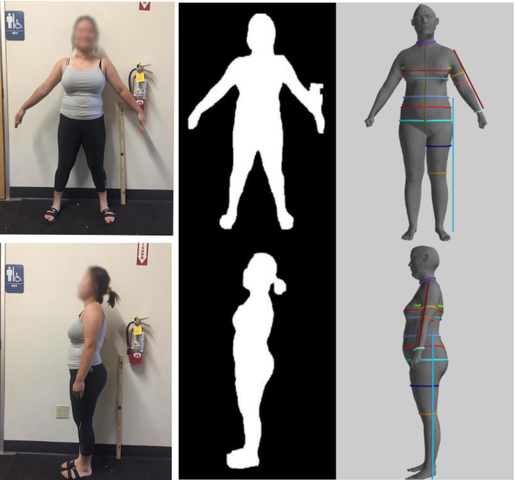

<!-- @import "[TOC]" {cmd="toc" depthFrom=1 depthTo=6 orderedList=false} -->
<!-- code_chunk_output -->

- [Introduction](#introduction)
- [Quick Start](#quick-start)
- [Web-App](#web-app)
- [Documentation](#documentation)
  - [Body Reconstruction](#body-reconstruction)
  - [Head Reconstruction](#head-reconstruction)

<!-- /code_chunk_output -->

# Introduction

This repos contains the implementation of a deep learning pipeline that generates a 3D human avatar with 22 body measurements from just a pair of input front side human images within seconds. 

Generally, two input images will be passed to a deep learning model to estimate the human silhouettes, which are then stacked together and passed to another deep learning model that predicts body parameters of a statistical human model.  These body parameters will be then optimized to fit better to body keypoints landmarks and the silhouettes. Finally, a human mesh is calculated and the 22 body measurements are extracted. 

     

# Quick Start
Following [this instruction](notes/cnn_pipeline_instruction.md) to quickly bring up the whole pipeline.

# Web-App
The system also comes with a web portal for testing the main features of the pipeline.
  - Manage and store multiple subjects in a SQL database.
  - Predict 3D human shapes for subject
  - Calculate measurements on the predicted 3D body shapes.
  - Support compare the measurement error given the groundtruth measurements.

To bring up the web portal with the pre-trained models (stored in google drive), please follows [the instructions](/notes/web_portal_instruction.md)

# Documentation
## Body Reconstruction
- [How to build training data from the Caesar dataset](./notes/vic_mpii_deformation_pipeline.md)
- [How to train the shape prediction model](./notes/cnn_pipeline.md)
- [The possible effect of camera properties on silhouette](./notes/cnn_camera_effect.md)
- [A summary of the slice-based method](./notes/slice_method_summary.md)
  
## Head Reconstruction
- [Explanation of the head reconstruction pipeline](./notes/head_reconstruction.md)
- [Head reconstruction paper list](./notes/head_reconstruction_paper_list.md)
