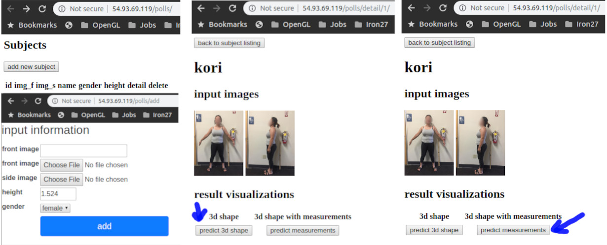

<!-- @import "[TOC]" {cmd="toc" depthFrom=1 depthTo=6 orderedList=false} -->
<!-- code_chunk_output -->

# 3D human avatar from simple images. 

This repos contains the implementation of deep learning pipelines that generates a 3D human avatar with 22 body measurements from just a pair of input front side human images within seconds.

# web-app
The system also comes with a web portal where the user can upload a pair of front-side images and get back their avatar aftera just a few seconds.

