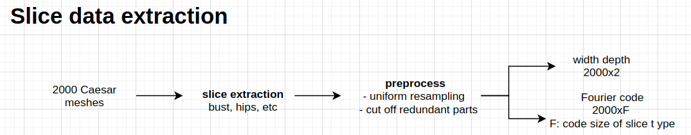
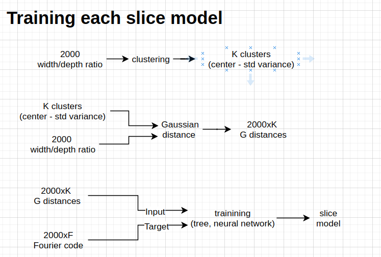
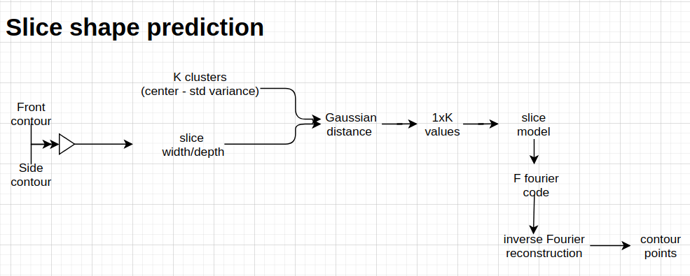

#  How to run deformation algorithm
    1. Install libraries
        conda install numpy scipy

    2.How to run all in one
        1. run on a simple test case of sphere mesh
            cd to human_estimation folder
            sh df_sphere_run.sh

        2. run on human test case
            cd to human_estimation folder
            sh df_body_run.sh

    3.How to run step by step
        - cd to the human_estimation folder

        - calculate parameterization of the template mesh (victoria) with respect to the original control mesh
            python ./src/ffdt_deformation_parameterize_tool.py  -ctl ./data/meta_data/origin_control_mesh_tri.obj -tpl ./data/meta_data/origin_template_mesh.obj -g 1 -o ./data/meta_data/global_parameterization.pkl

        - reconstruct a new template mesh based on the deformed control mesh
            python ./src/fftdt_deformation_reconstruct_tool.py -t ./data/meta_data/origin_template_mesh.obj -d ./data/ctr_mesh/IMG_1928_front_ctl_tri.obj -p ./data/meta_data/global_parameterization.pkl -o ./data/meta_data/output_deformed_mesh.obj

# Pipeline
  
  
  
  
  
  
# How to train slice models
    1. install libraries
        conda install numpy scipy matplotlib scikit-learn
        conda install -c conda-forge shapely 
        conda install -c anaconda tensorflow-gpu keras
        pip install dtreeviz
        
    2. download dataset, denote the path to the dataset is DATA_SET_DIR
	- DATA_SET_DIR/female_slice contains slice contours of caesar females. Each contour consist of (x,y) coordinates. These contours are just for the purpose of visualization. 
	- DATA_SET_DIR/slice_code/fourier contains the actual training data. It consists of width, depth and fourier code of each contour. Note that fourier code is already scaled and normalized. To understand more about the data structure, please check the function load_slice_data in file slice_regressor_training_tool.py
	- DATA_SET_DIR/bad_slices contrains a text file which list bad, irregular file names for each type of slice
	
    3. run slice_regressor_training_tool.py 
        -i DATA_SET_DIR/female_slice/ 
        -c DATA_SET_DIR/slice_code/fourier/ 
        -b DATA_SET_DIR/bad_slices/ 
        -d OUTPUT_DEBUG_DIR 
        -m OUPUT_MODEL_DIR
        -ids Hip
        -test_infer 1 
        -train_infer 0
    
	the parameter "ids" tell the tool which slice type it should train. The slice id is corresponding to sub folder names under DATA_SET_DIR/female_slice
    
    the parameter "test_infer" tells the tool to use the model to infer the slice contour from the trained models and output result visualiazation to the folder OUTPUT_DEBUG_DIR
     
    4. code guildelines
        - to understand about training data, please refer to the function "load_slice_data" in slice_regressor_training_tool
        - to understand about k-means clustering, model training, please refer to the model definition inside slice_regressor_detree.py
   
    
    
# How to run shape-key analysis
    1. set up enviroment 
        conda create --name human_estimation
        conda install -n human_estimation -c conda-forge opencv 
        conda install -n human_estimation scipy numpy matplotlib
	    conda activate human_estimation

    2. what does shape_key_analyze do?
        this code preprocesses silhouette projections from Blender
        and compare silhouettes of each shape-key at values of 0 and 1
    
    3. instruction to analysize silhouete from blender's silhouette projections	
        - download blender projects: victoria_silhouette_projection.zip
            - run two blender projects to project 3D models to front and side silhouettes (update the output directories)
            - update directories in the file shape_key_analyze.py to point to blender silhouette directories
            - run shape_key_analyze.py
