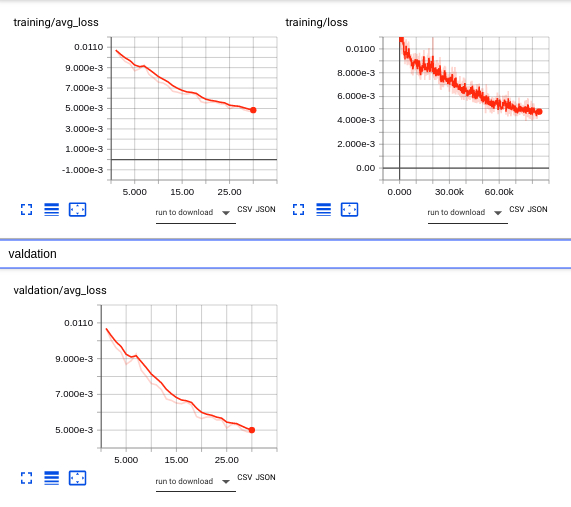

# install requirements
```python
conda env create -f environment.yml
```

# run the pre-trained models
- download [the models](https://drive.google.com/open?id=1l_Tc83U2ZVafjaq6XunPkLrTdrq93RCS) and put them under the folder ./deploy_models
- download [the test data](https://drive.google.com/open?id=1BLL8VAjId6qBA3p6ebytQRsY7Xk0hCp7)
- move to the folder source
- run the code
```python
export PYTHONPATH="${PYTHONPATH}:./"
python ./deploy/hm_pipeline.py -model_dir MODEL_DIR/deploy_models -in_txt_file TEST_DATA_DIR/data.txt
```

# run measurement calculation on predicted vertices
- for more information about measurements, please refer to the chart picture in __/notes/woman_measurement_chart.jpg__
- download the [meta-data](), put them under ./deploy_models/meta_data/ 
- move to the folder source
- run the code
```python
export PYTHONPATH="${PYTHONPATH}:./"p
python ./deploy/hm_measurement.py -obj path_to_obj_file -grp ./deploy_models/meta_data/victoria_measure_vert_groups.pkl -nbr ./deploy_models/meta_data/victoria_measure_contour_circ_neighbor_idxs.pkl
```
# train model
## training
- download the original dataset (4301 meshes) from [this link](https://drive.google.com/open?id=1c9eHv9NBo4PkfpRCHWix1wzCKumsICG3), 
or the synthesized dataset (62000) from [this link](https://drive.google.com/open?id=18Kaj8A18wEMiZmmi7y9k9QDmSsFrcQO_)
- denote DATA_DIR point to the root directory of the dataset. For example, ```root_dir/sil_384_256_ml_fml_nosyn```
- run the following commands: this shell script will sequentially train front, side and then the joint model. The final joint model
will be converted from Pytorch to Tensorflow graph and wrapped with additional information for inference.
    ```python
    cd ./src
    sh train_cnn.sh DATA_DIR
    ```
- for more stable training,you can comment the code in the sn_train_cnn.sh to train modes one by one
## training error visualization
- run tensorboard
    ```python
    cd DATASET_DIR/log
    tensorboard ./f #for the front model
    tensorboard ./s #for the side model
    tensorboard ./joint #for the side model
    ```
- open the web brower to check the error


- run inference on the model: copy the shape_model.jlb file to the deploy model directory and go back to the "run the pre-trained models" step

# documentation
## body reconstruction
- [an overview of cnn-based pipeline](./notes/cnn_pipeline.md)
- [improvement ideas for the cnn-based method ](./notes/cnn_improvement_list.md)
- [a summary of the effect of camera properties on silhouette](./notes/cnn_camera_effect.md)
- [testing ideas for the cnn-based method](notes/testing_ideas.md)
- [a summary of the slice-based method](./notes/slice_method_summary.md)
- [victoria-caesar deformatin pipeline](./notes/vic_mpii_deformation_pipeline.md)
## head reconstruction
- [head reconstruction pipeline](./notes/head_reconstruction.md)
- [head reconstruction paper list](./notes/head_reconstruction_paper_list.md)