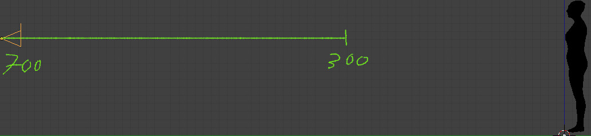
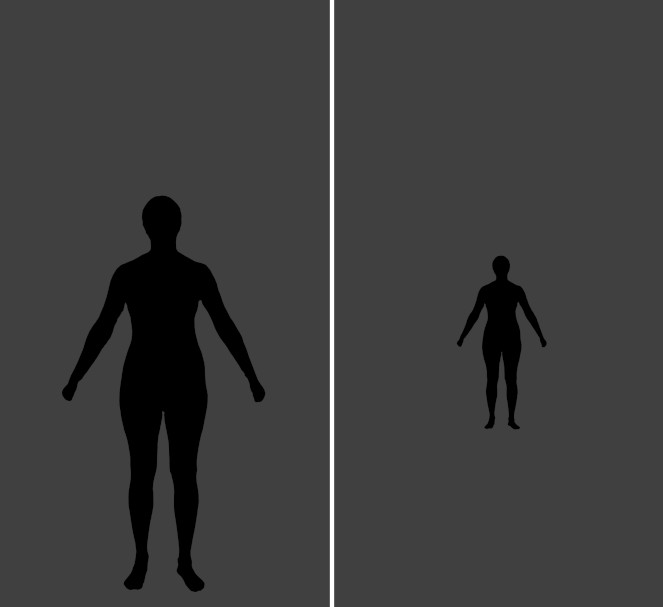
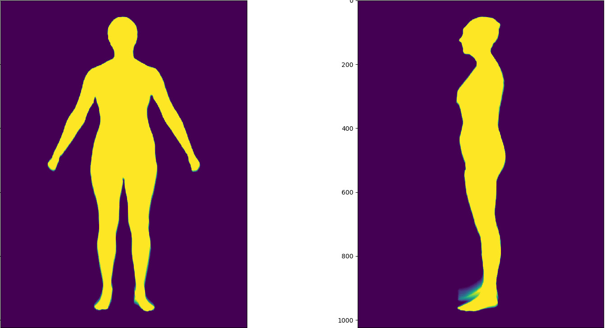
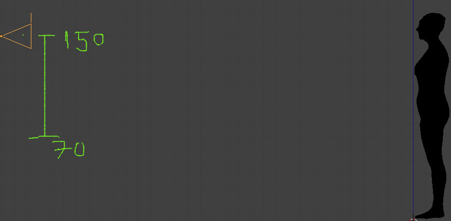
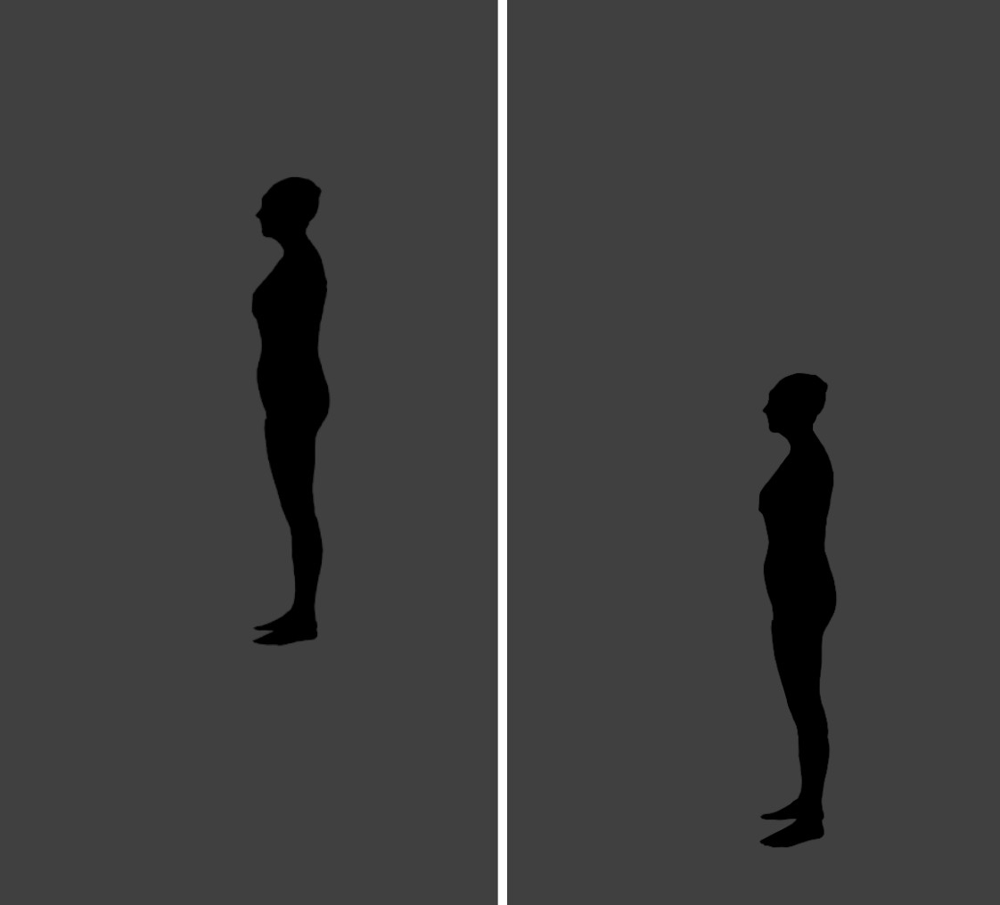
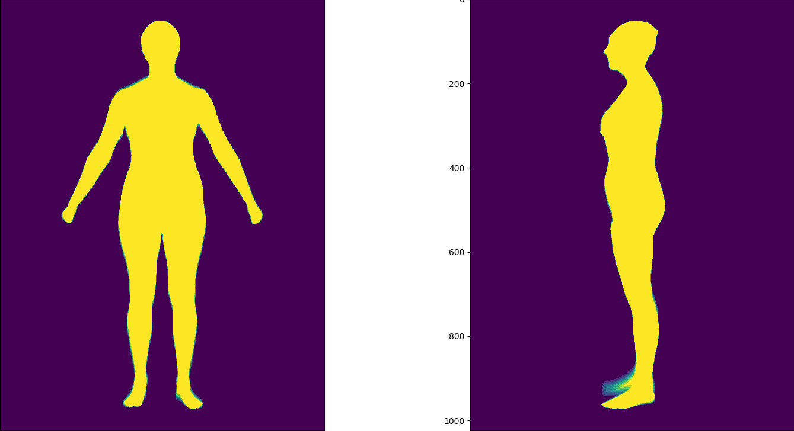
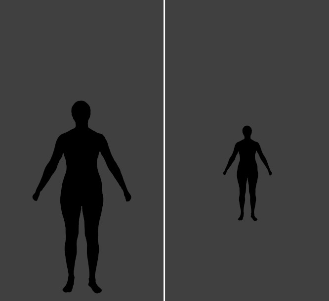
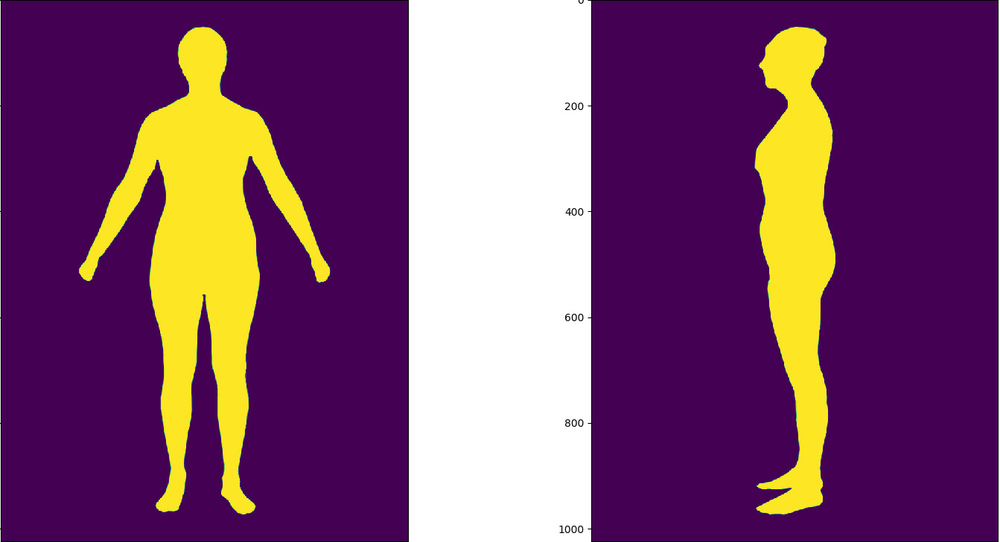

# purpose
find out how three camera properties: camera distance, focal length and camere height affect the front and side Silhouettes

# observation
- focal lengths don't have affect on normalized silhouette

# different camera distances
configuration
 - mesh height: 165
 - camera distance range: [300, 700]
 - camera
 
 - real silhouettes
 
 - normalized silhouette heat map
 

# different camera heights
configuration
  - mesh height: 165
  - camera height range: [70, 150]
  - camera
  
  - real silhouettes
  
  - normalized silhouette heatmap
  

# different focal lengths
configuration
  - mesh height: 165
  - focal length range: [2.5mm, 5.0mm]
  - real silhouettes
  
  - normalized silhouette heat map
  
