<!-- @import "[TOC]" {cmd="toc" depthFrom=1 depthTo=6 orderedList=false} -->
<!-- code_chunk_output -->

- [Synthesize shapes using MB-lab add-on](#synthesize-shapes-using-mb-lab-add-on)
- [UCSC dataset integration](#ucsc-dataset-integration)
- [perspective distortion](#perspective-distortion)
- [cnn part segmentation input](#cnn-part-segmentation-input)
- [A pose variant (done)](#a-pose-variant-done)
- [Influence of front/side silhouette location on result (done)](#influence-of-frontside-silhouette-location-on-result-done)
  - [Experiment description](#experiment-description)
  - [Result](#result)

<!-- /code_chunk_output -->

# Synthesize shapes using MB-lab add-on
- [MB-lab addon](https://mb-lab-community.github.io/MB-Lab.github.io)
- Write MB-lab script to synthesze new meshes
- Following [the instruction](./vic_mpii_deformation_pipeline.md) to transfer the synthesized shapes to Victoria.

# UCSC dataset integration
- Download the dataset [here](https://graphics.soe.ucsc.edu/data/BodyModels/index.html)
- Following [the instruction](./vic_mpii_deformation_pipeline.md) to transfer the shapes to Victoria.

# perspective distortion
- __There are 3 camera factors that we could cause perspective distortion__
  - __camera orientation is not straight up__

    - it could happen that user's camera looks up or down instead of parallel to the ground. It causes different  height of the subject in the image. Fortunately, this problem could be avoided by implementing an app feature that give feedback to users about their camera orientation
    - 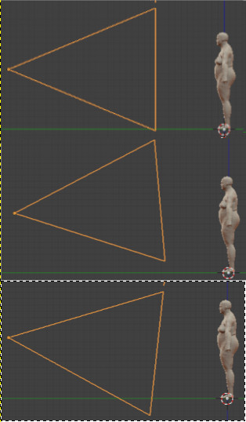
    - 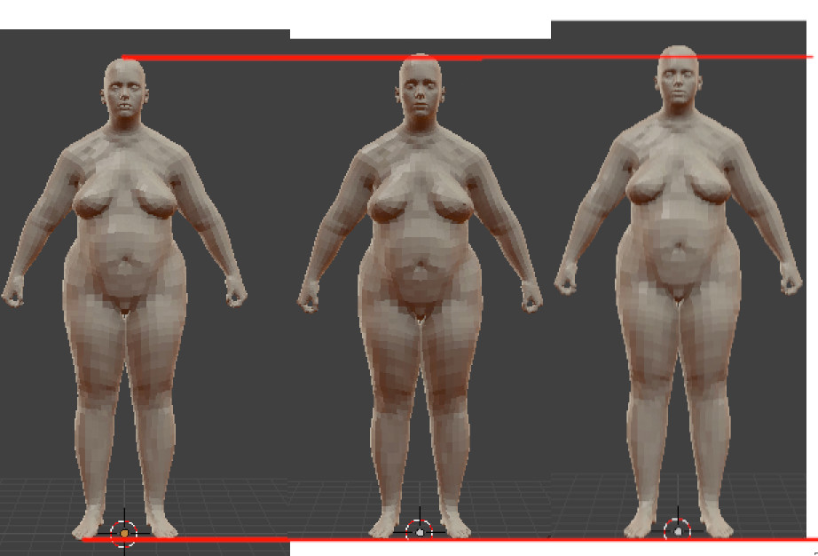

  - __different camera distances or focal length__
    - these two factors could cause different heights of the subject in the image and distort the subject.
    - For the different height problem, we already scale front and side silhouette to the same height so that the normalized silhouettes take up 80% of height of the image of 384x256. We then compensate for this normalized height by passing the user height as an input to CNN model.

    - the distortion problem is more tricky. From my experiment of superimposing different subjects taken at different distances and focal length, the silhouettes are affected more by different distances than focal lengths. However, in overall, the silhouettes just change at feet regions; other body parts are still the same.   we need to do more experiment to quantify this effect.

  - __different camera heights from the ground__
    - Currently, the training Caesar silhouettes are taken at a fixed distance for all meshes. This case doesn't exist in practice because user camera height will change from case to case. We need to do experiment to investigate how silhouette is distorted in response to camera height.
    - one possible solution to this problem is that we can tell user to put the camera at their neck level and we also do the same while generating training silhouettes by adjusting camera's height to the neck level of the Caesar subject.
- __reference about scale ambiguity problem__
  - [Section 3.3 One view] HS-Nets: Estimating Human Body Shape from Silhouettes with Convolutional Neural Networks
  - [Section 3. The Generative and Cross-Modal Estimator] Human Shape from Silhouettes Using Generative HKS Descriptors and Cross-Modal Neural Networks.
  - [Section 4 Scale ambiguity] Neural Body Fitting: Unifying Deep Learning and Model Based Human Pose and Shape Estimation
  - [Section 4 Scale ambiguity] Learning to Reconstruct People in Clothing from a Single RGB Camera
  - [6.4. Impact of visibility] Tex2Shape: Detailed Full Human Body Geometry from a Single Image

# cnn part segmentation input

__Notice__: check [this repository](https://github.com/tensorflow/tfjs-models/tree/master/body-pix) for body-part segmentation implementation.

- instead of passing binary silhouettes to the CNN model, we pass in part segmentation color images as depicted in below.
- 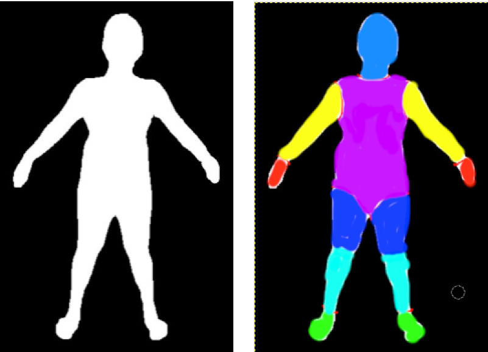
- 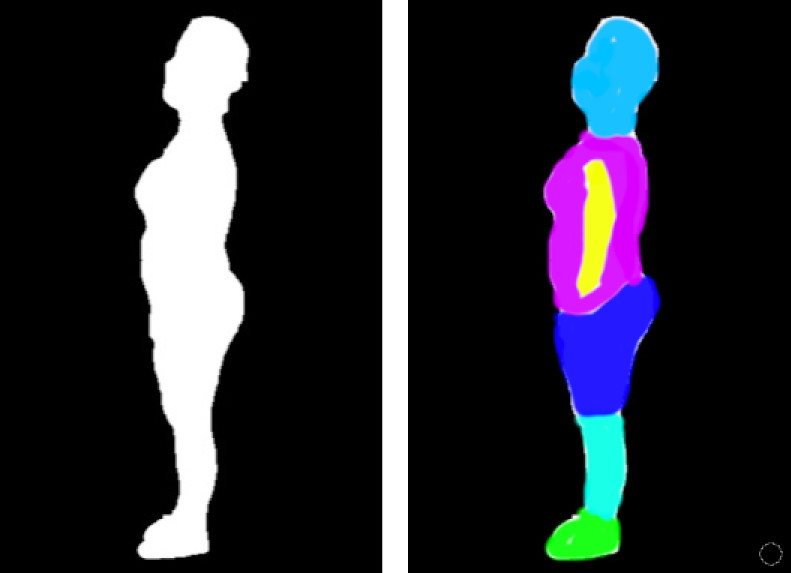
- __why does it help?__
  - the separated body parts will help the model find a better correlation between human subject and the PCA values. For example, if there exists a relation between torso width and some PCA values, the model could find it more easily if it was told where is the torso in the silhouette, instead of finding the torso part by itself.

  - it's just my guess that it could make the model more robust to A pose variants. From our experiment with different pose, when angle between two legs increases, the whole prediction mesh is changed. So if the model know where is the leg, it might just adapts the leg shape instead of the whole mesh.    

  - it could make the model more robust for extreme cases, (fat customers) where two legs are so big that they are so close to each other. In this case, the prediction could go wrong due to ambiguous leg shape.
  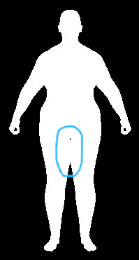

  - As mentioned in figures of our CNN architectures, we reuse the Densenet architecture in the standard Pytorch library. However, this architecture just take in an RGB image while we just pass in binary image; therefore, we have to customize the first layer of the standard Densenet architecture to force it to take in binary input. With this customized architecture, we have to train the weight of Densenet from scratch instead of fine-tuning it with the pre-trained weights from the Pytorch library.      

# A pose variant (done)
- [link to experiment result](https://drive.google.com/open?id=1p_SLMMV-UEoSdD8sJaX9JmLGnQpe7Qpf)
- __below figures depicts the effect of A pose variants on the result__. It seems that the torso pose affects the results the most.
    - torso lean forward
    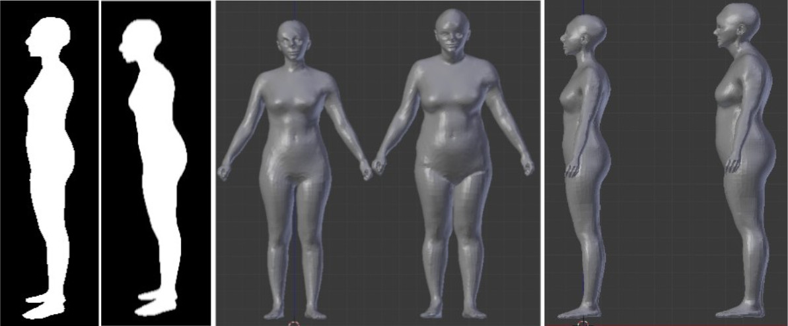
    - torso lean backward
    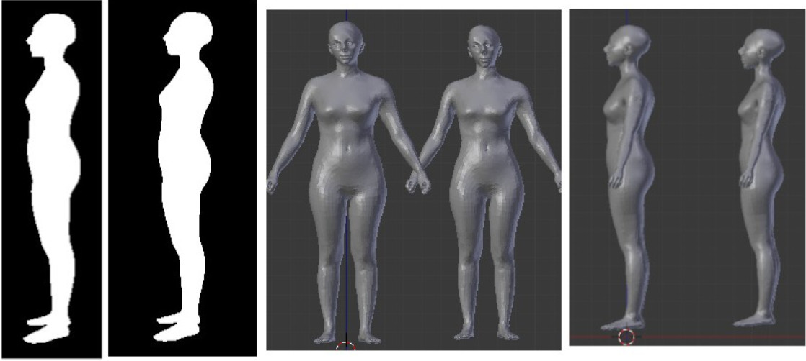
    - wide arm, leg
    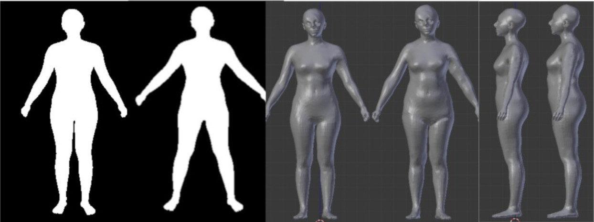
    - narrow arm
    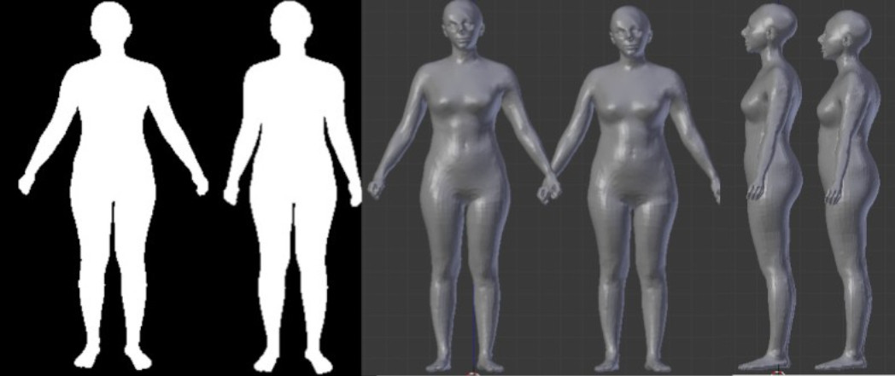

- __there are currently three possible solutions to this problem__.
  - more strict at the front-end side by forcing users to pose their arm, torso and leg within a reference frame. However, the noise deviation from the standard A-pose could sill occur.
  - A-pose silhouette augumentation: for each caesar mesh, synthesize more variants of the standard A-Pose by bending its leg, arm and torso with different angles.
  - A-pose correction before feeding the silhouette to the network.
    - https://www.youtube.com/watch?v=P9fqm8vgdB8
    - https://libigl.github.io/tutorial/#bounded-biharmonic-weights

# Influence of front/side silhouette location on result (done)

## Experiment description
In this experiment, the front and side silhouettes are shifted to the left and side direction to see how does the result
will change.

- input image pair

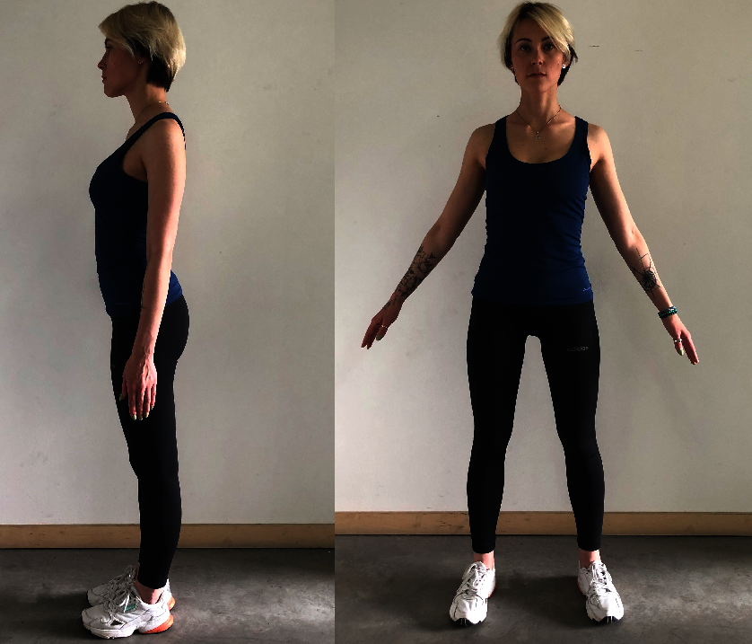

- pre-processed silhouettes

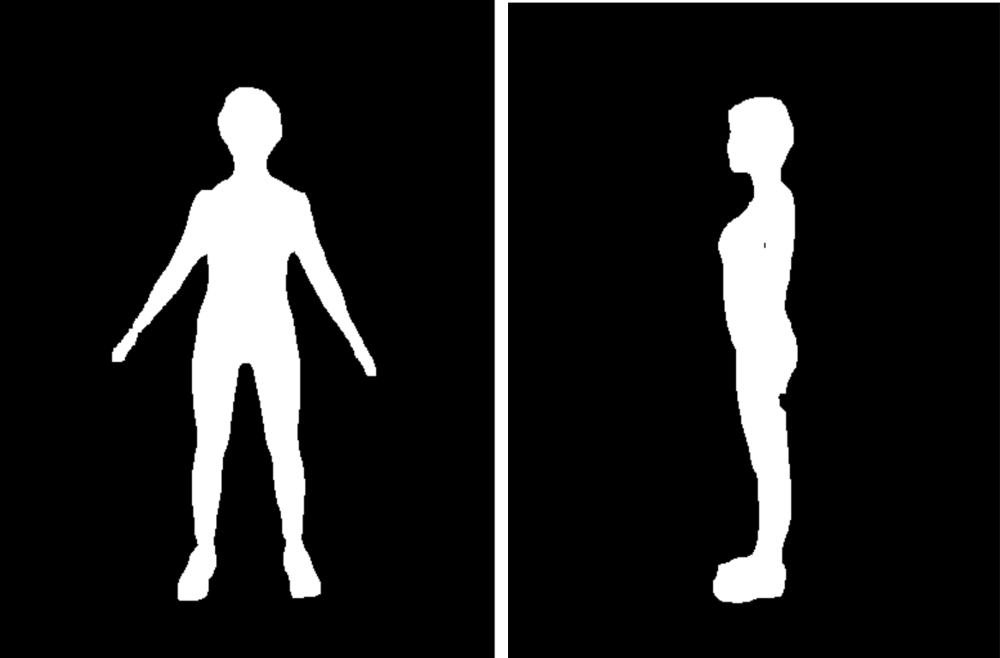

- side silhouettes are shifted toward left and right.

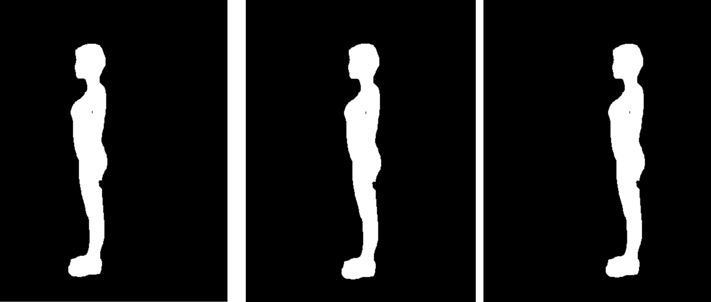

- front silhouettes are shifted toward left and right.

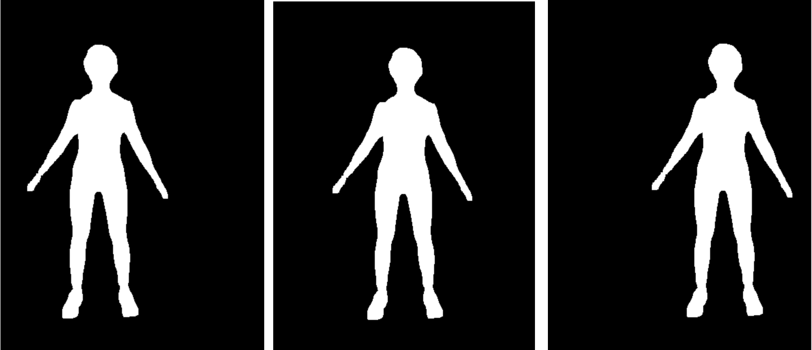

## Result
in both cases where side and front silhouettes are shifted, the 3D prediction meshes are exactly the same.
- shifted side silhouette result: 3 meshes are drawn over each other, and there is not difference
in the side profile

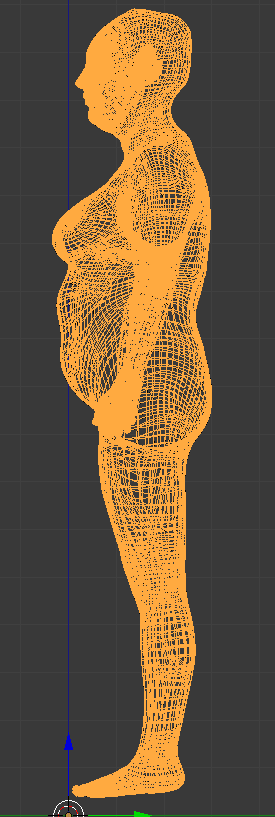

- shifted front silhouette result: 3 meshes are drawn over each other, and there is not difference
in the front profile.

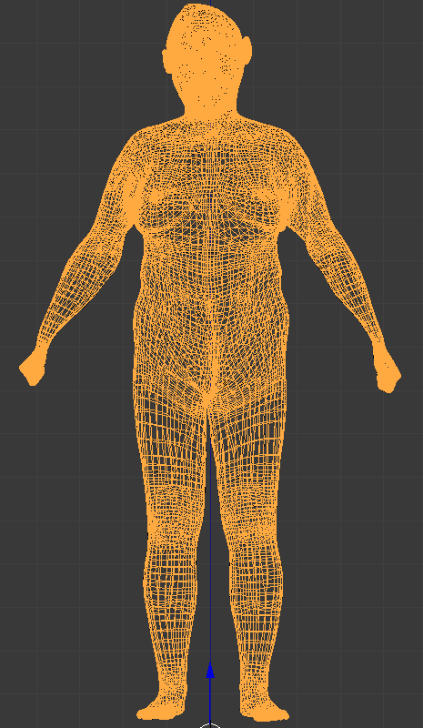
