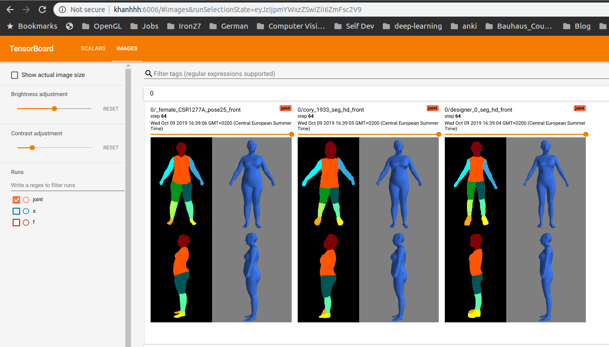

This note describe the steps to train the shape models. Doing all the steps are unnecessary because the output data of each step could be downloaded from google drive.

# Install requirements

manually remove libraries from environment.yml: tf-pose, pycoco

```python
conda env create -f environment.yml
```

__tf-openpose__
```bat
conda activate environment_name
cd /third_parties/tf-pose-estimation/
RUN python setup.py install
```
__libigl__
```bat
conda activate environment_name
cd third_parties/libigl/build
cmake .. -DLIBIGL_WITH_EMBREE=OFF
make
```
check the folder **third_parties/libigl/python** to see if **pyigl.so** is built successfully.

__additional libraries__
```
conda activate environment_name
conda install -c conda-forge shapely
pip install triangle
```

Before trying to bring up the training, please try to run infernece to test if everything is ok.

# Run inference

Download the following data folders

[MODEL_DIR](https://drive.google.com/open?id=1DodUpuB2jQVyft2actWVWASY5adJtLXE)

[META_DATA_DIR](https://drive.google.com/open?id=1ZeY6ymkUFzuKW0gBoXTcPHblvpIOVlbr)

[TEST_INFERENCE_DATA](https://drive.google.com/open?id=1k6H-gYbKx-qX90PHs1s-YvUOhndFvLgt)

```bat
cd /human_estimation/src/
export PYTHONPATH="${PYTHONPATH}:./"
export PYTHONPATH="${PYTHONPATH}:../third_parties/"

python deploy/hm_pipeline_full_demo.py
-model_dir MODEL_DIR
-meta_data_dir META_DATA_DIR
-in_txt_file
TEST_INFERENCE_DATA/data_measurement.xlsx
-out_dir
TEST_INFERENCE_DATA/result_mesh/
-out_viz_dir
TEST_INFERENCE_DATA/result_visualization/
-out_measure_dir
TEST_INFERENCE_DATA/result_measurement/
```


# 1. PCA male/female models training

Follow the following steps to train male/female PCA models

Download [the dataset](https://drive.google.com/open?id=1dxneLcuc3m32EAgW_UjPv539pmX5ymVG), which consists of a Victoria mesh, around 4000 vic-caesar meshes with male/female labelling.

```bat
export PYTHONPATH="${PYTHONPATH}:./"
python ./pca/pca_vic_train.py -vert_dir CAESAR_VERT_DIR -vic_mesh_path VIC_OBJ_PATH -female_names_file TXT_FEMALE_NAMES_PATH -out_dir OUTPUT_DIR -n_synthesize_samples 0
```

For further information about the parameters, please refer to the help from the code. In general, the code performs the following tasks
- train two pca models for male and femle
- export the first 10 principal components for each PCA model for the sake of debugging.
- synthesize more PCA values for each model, if the param __n_synthesize_samples__ is greater than zero. If you don't want to synthesize new meshes from the trained PCA model, set  __n_synthesize_samples__ = 0
- export the mesh vertex arrays for all meshes to the folder PCA_MOEL_PATH/verts/. These vertex arrays will be the input for the Blender script to generate silhouette images.
- export a number of random OBJ meshes (original or synthesized mesh) for the sake of visualization.

# 2. Silhouette generation
Do the following steps to generate silhouettes. __Notice__ that it will take very long to generate silhouettes/poses for all meshes; it is recommended to  change the script to test a few meshes first.

 - install Blender 2.79b. Other versions are not tested yet.
 - start [the blender file](https://drive.google.com/open?id=1m1O43Qmq3-4DVdJ7hJyyD251Lf8FkOKa): caesar_project_silhouette_pose_variations.blend

 - press NUMPAD key 0 to make sure that the 3D view is in projection camera mode. This step must be done; otherwise, the generated silhouettes will be rendered from the view manipulation camera matrix of Blender.

 - update the input/output directory inside the script to point to the folders on your PC. We have to adjust it manually because Blender argument parsing does not work.

    - __verts_co_root_dir__ points to the root folder of male/female vertices. Specifically, '__verts_co_root_dir/male__' will contains *.npy male mesh vertex arrays and '__verts_co_root_dir/female/__' will contains female vertex arrays.

    - __out_sil_root_dir__: the output root directory for storing front/side silhouettes of pose variants. Specifically, the blender script will export male silhouettes to the folder "__out_sil_root_dir/male/sil_f_raw__" and the folder ""__out_sil_root_dir/female/sil_f_raw__". The same goes for female silhouettes.

The output data for this step can be downloaded here

# 3. Silhouette post processing

```bat
export PYTHONPATH="${PYTHONPATH}:./"
python ./pca/tool_prepare_train_data_ml_fml.py
-sil_dir RAW_SIL_DIR
-target_ml_dir PCA_MODEL_DIR/pca_coords/male/
-target_fml_dir PCA_MODEL_DIR/pca_coords/female/
-pca_ml_model_path PCA_MODEL_DIR/vic_male_pca_model.jlb
-pca_fml_model_path PCA_MODEL_DIR/vic_female_pca_model.jlb
-resize_size 384x256
-out_dir OUPUT_CNN_DATA_DIR
```
- __RAW_SIL_DIR__ is the output folder that Blender script exports male and female silhouettes.
- __PCA_MODEL_DIR__ is the output folder from the PCA training step. If you follow exactly the PCA training step, this folder __PCA_MODEL_DIR__ should contains the following data.
  - Two sub-folders, "__pca_coords/female__" and ""__pca_coords/male__"  store PCA coordinates of both original and synthesized PCA coordiantes.
  - Two PCA model files "__vic_male_pca_model.jlb__" and "__vic_female_pca_model.jlb__"  that wraps the PCA male/female models.

- __OUTPUT_CNN_DATA_DIR__: the output folder where the processed silhouettes and the final PCA coordinates will be stored. It is recommended that this folder should be the same as __RAW_SIL_DIRs__. After the script finishes, this ouput folder will contain the following sub-folders
  - __OUTPUT_CNN_DATA_DIR/sil_f__: processed front silhouettes of both male and female.
  - __OUTPUT_CNN_DATA_DIR/sil_s__: processed side silhouettes of both male and female.
  - __OUTPUT_CNN_DATA_DIR/target__:  final PCA target with male/female indicator for training.s

The output data for this stage can be downloaded here

# 4. Training
we need 3 kinds of data for this stage.

- __CNN_DATA_ROOT_DIR__: the output folder from the previous stage . Under this folder, we should find 3 sub-folders: __sil_f__, __sil_s__ and __target__ that contanis front/side silhouettes and training targets and files __height.txt__, __pca_model.jlb__

- __META_DATA_DIR__: please download from [this google driver link](https://drive.google.com/drive/folders/1ZeY6ymkUFzuKW0gBoXTcPHblvpIOVlbr) and set  __META_DATA_DIR__ to the downloaded folder. Make sure that the file "__vic_sparse_key_verts.npy__" exists under this folder. We need this file for vertex loss monitoring on Victoria keypoints.

- __TEST_DATA_PATH__: please download the folder from [this google driver link](https://drive.google.com/open?id=1LbT9OoEmvQtBEO8-qc69XqcHFdl9PCda) and set __TEST_DATA_PATH__ to the file __data.txt__ under the downloaded folder. This argument is for exporting dynamic results during training, so that we can see how the model is evolving.

cd to the folder /src and run the train_cnn.sh bash script that trains front, side, and joint models sequentially.

```bat
sh train_cnn.sh CNN_DATA_ROOT_DIR META_DATA_DIR TEST_DATA_PATH
```

# 5. Training visualization
- Start the tensorboard
    ```bat
    cd __CNN_DATA_ROOT_DIR__
    tensorboard --logdir=./log
    ```
- Follows the instructions from tensorboard output to open the logging browser, where we can see the training loss graph and visualization of prediction mesh during training. Below is a simple output from Tensorboard.


- Note that we can only see the visualization after a few epochs because we only export the prediction mesh visualization every 4 epochs.
