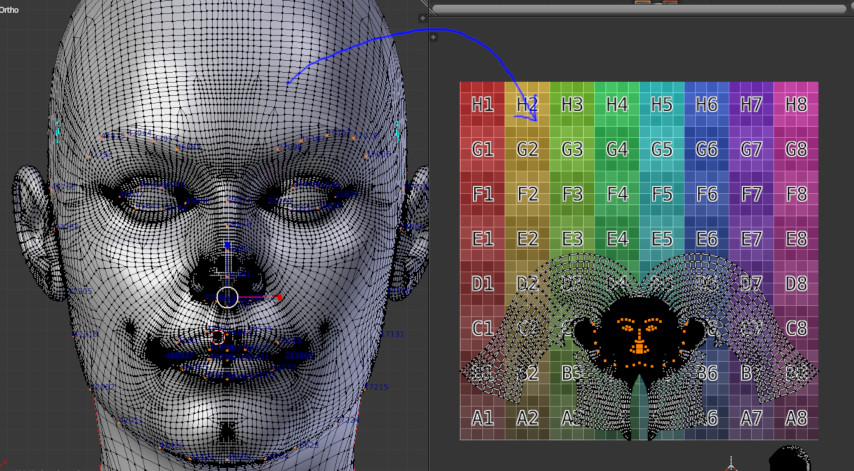
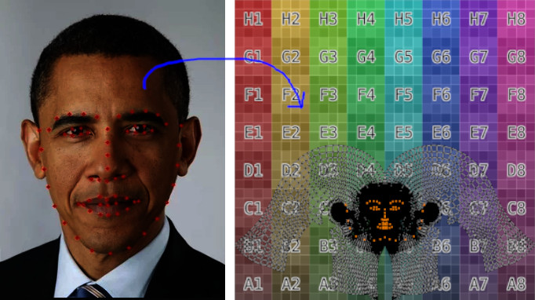
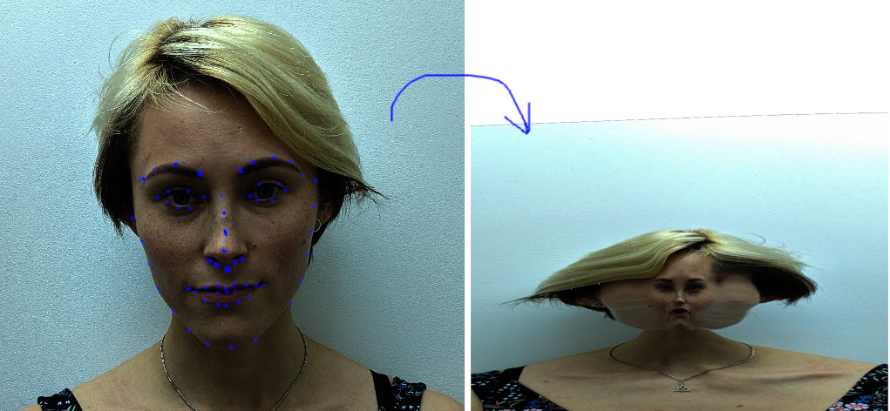

## Next steps
  - investigate the correctness of 3D landmarks on the deformed Victoria face
  - check if it's possible to downsample the resolution of the PRN facelib output directly, instead of transferring its shape by the deformation algorithm like we're doing now.
  - as a preprocessing step, try to apply a thin-plate warping to convert the default Blender texture map to match Facelib texture map. By doing this way, we can use the texture map from Facelib directly, which might help avoid the inconsistency betwene 3D and 2D
  - will update later. please feel free to add more.
## head reconstruction Pipeline
### preprocessing stage
  - 3D face alignment
    - manually mark 68 landmarks on Victoria face
    - extract the corresponding 68 landmarks on a sample face from PRN facelib. To get this face, I run facelib on good front image of a model.
    - use the 68 landmark correspondences to estimate an affine transformation (translation + rotation + scale + no shearing) to transform PRN facelib to coarsely align with Victoria face.
    - use Biharmonic deformation with the 68 landmarks as the handle points to deform Victoria face to match PRN facelib. This is done is two sub steps
      - replace Victoria face's landmark positions by PRN's facelib landmark positions.
      - apply biharmonic deformation to reconstruct a new Victoria's face from the modified landmarks.
    - use nonrigid iterative closest iteration to improve the alignment.
    - smooth the mesh and apply shrink wrap.
    - the final result will look like this.

      

  - parameterization
    - at this step, two faces should be well aligned and corresponding landmarks should be at the same locations.  
    - after two faces are well aligned, we represent each vertex of Victoria's face with respect to a set of neighboring triangles from PRN face.
  - texture mapping
    - use blender Unwrap tool for the head. Scale and translate the head texture map a bit. we call it Blender default texture map.
    - the result is shown in the below picture.

      

### real-time stage
  - head geometry
    - use pre-calculated paramterization to deform Victoria's face to match PRN face. The result is a deformed Victoria face.
    - replace the customer's head by Vicotoria's head (scale + translation). This replacement will cause the discontinuity at the neck seam.
    - use affine transformation to replace the original victoria face by the deformed Victoria face. This replacement will result in discontinuity at the face boundary seamm.
    - use biharmonic deformation to smooth out the face and neck seams

  - texture mapping
    - use Opencv/Dlib to detect 68 facial landmarks on the customer's face
    - given the 68 corresponding facial landmarks from the default Blender texture mapping, estimate a thin plate warping that transform the front face image of the customer to the default Blender texture mapping.
    
    
