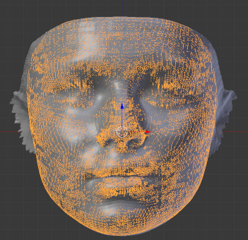
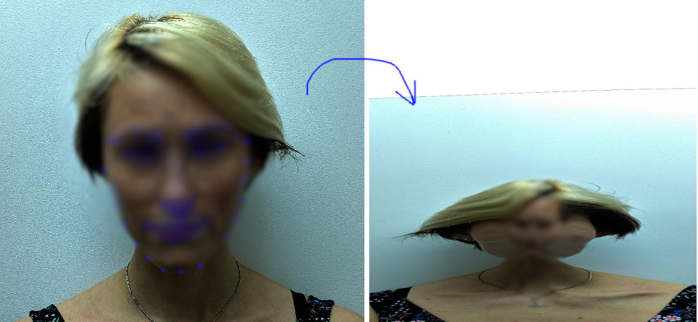

<!-- @import "[TOC]" {cmd="toc" depthFrom=1 depthTo=6 orderedList=false} -->
<!-- code_chunk_output -->

- [Pre-processing stage](#pre-processing-stage)
  - [3D face alignment](#3d-face-alignment)
  - [Parameterization](#parameterization)
  - [Victoria UV unwrapping](#victoria-uv-unwrapping)
- [Test-time stage](#test-time-stage)
  - [Head geometry](#head-geometry)
  - [Texture mapping](#texture-mapping)

<!-- /code_chunk_output -->

# Pre-processing stage

All the steps explained in this pre-processing stage are already done and the outputs of steps are all uploaded to the google driver folder [meta_data](https://drive.google.com/open?id=1ZeY6ymkUFzuKW0gBoXTcPHblvpIOVlbr). Instructions here are for reproducing these outputs or fine-tuning in the future.

## 3D face alignment

The purpose of this stage is to find a 3D alignment between the PRN facelib mesh and the corresponding face region of Victoria. With this alignment, we can compute a parameterization between the two meshes and then, in the test time, transfer the shape from PRN facelib mesh to the Victoria face mesh for a new person.

The input to this step consists of two meshes:

- __The Victoria face mesh__ that I extracted from the full Victoria mesh. Remember that this is an independent mesh from Victoria mesh that I separated to make the alignment and parameterization easier. The mapping from this face mesh to the full Victoria mesh (for example, vertex 0 of this mesh is mapped to the vertex 1000 of the other mesh).

- __The PRN facelib mesh__. This mesh topology will be used to represent the face shape predicted by the PRN neural network.

To check the meshes before and after alignment, please check the folder [face_alignment](https://drive.google.com/open?id=1YmrtTYEIWp0NPEaGPmojBUS1xheCpXdj), a sub folder under the folder __meta_data__.

Below are the steps that I did to create the alignment. However, these steps are quite manual and error-prone. For a new/better approach to achieve the alignment, please check this new blender add-on: [softwrap](https://blendermarket.com/products/softwrap).

- manually mark 68 landmarks on Victoria face

- extract the corresponding 68 landmarks on a sample face from PRN facelib. To get this face, I run facelib on good front image of a model.

- use the 68 landmark correspondences to estimate an affine transformation (translation + rotation + scale + no shearing) to transform PRN facelib to coarsely align with Victoria face.
- use Biharmonic deformation with the 68 landmarks as the handle points to deform Victoria face to match PRN facelib. This is done is two sub steps
  - replace Victoria face's landmark positions by PRN's facelib landmark positions.
  - apply biharmonic deformation to reconstruct a new Victoria's face from the modified landmarks.
- use nonrigid iterative closest iteration to improve the alignment.
- smooth the mesh and apply shrink wrap.
- the final result will look like this.
  

## Parameterization

at this step, two faces should be well aligned. Aligned means that corresponding landmarks and surrounding vertices of two meshes should be very close.

parameterization of Victoria  face mesh with respect to the PRN facelib mesh is the input to [the deformation algorithm t-ffd](https://dl.acm.org/citation.cfm?id=781641) that, in the test time, deforms the original Victoria face mesh to match the new shape of the PRN facelib.

parameterization here means that a vertex of Victoria face mesh is represented in terms of multiple neighboring triangles in the PRN facelib mesh. Therefore, in the test time, each vertex of Victoria face mesh could be reconstructed from these neighboring triangles.

Here are instructions to calculate this parameterization.

```bat
export PYTHONPATH="${PYTHONPATH}:./"
python ./deformation/ffdt_deformation_parameterize_tool.py
-ctl PATH_TO_THE_ALIGNED_PRN_FACEMESH
-tpl PATH_TO_THE_ALIGNED_VIC_FACEMESH
-out_name_id parameterization_vic_face_prn_facelib
-o OUTPUT_DIR
-mode global
--effective_range 3
```
- PATH_TO_THE_ALIGNED_PRN_FACEMESH: the path to the file "face_prnnet_lib_aligned_v1.obj"
- PATH_TO_THE_ALIGNED_VIC_FACEMESH: the path to the file face_victoria_tri_aligned_v1.obj
- OUTPUT_DIR: output directory where the parameterization file will be stored.

The output of this stage, paramterization of Victoria face mesh with respect to PRN face mesh, is stored in the file "parameterization_vic_face_prn_facelib.pkl" under [the meta_data folder](https://drive.google.com/open?id=1ZeY6ymkUFzuKW0gBoXTcPHblvpIOVlbr).

## Victoria UV unwrapping
use blender Unwrap tool to unwrap Victora mesh to UV mapping. Scale and translate the head texture map a bit. Here is [a blender tutorial](https://www.youtube.com/watch?v=OE27_tVbUaw) for how to do it

the result is shown in the below picture.
  

To view the unwrapped UV map as shown above, please import the Victoria mesh "vic_mesh_textured_warped.obj" under [the meta_data folder](https://drive.google.com/open?id=1ZeY6ymkUFzuKW0gBoXTcPHblvpIOVlbr) to blender, switch to the edit mode and then, change view to "UV/Map editor"

# Test-time stage

## Head geometry

This stage consists of steps that transform the customer frontal face image to Victoria head mesh.

The general pipeline, as implemented in the method __HmHeadMode.predict__, is described below:

- __PRN face prediction__: use PRN facelib to predict face vertices (in PRN face topology) and a UV mapping from the input image to the texture space of PRN face mesh.

- __PRN face to Victoria face__: use pre-calculated [paramterization](#parameterization) to deform Victoria's face to match PRN facelib output. The result is a deformed Victoria face.

- __Victoria head embedding__: because of the customer head, (the head of the prediction mesh from the body model) is often distorted, we need to replace it with a better version. We do it by applying an affine transformation to the original Victoria head vertices to match the distorted head vertices. With this technique, we can have a head mesh at the same scale/orientation as the distorted head mesh, but still looks beautiful as the original head mesh. For more detail about this step, please check the method. After this stage, the head will look like the below picture. The left one is the distorted head and the right one is the template head fitted to the distorted head. "__embed_tpl_head_to_cusomter__" from __hm_head_model.py__


- __assign face and neck vertices__: At this stage, we transfer the vertex from the face mesh to the template head. We also assign the vertices from the neck boundary of the body mesh to the template head. The output from this stage will look like below.


- __boundary smoothing__: As we see in the previous stage, there is abrupt transition at the face boundary and neck boundary after we transfer the template head and the face. To make the transition smooth, we apply bi-harmonic deformation with face and neck as the boundary conditions and solve for the remaining head vertices. We use [lib-igl](https://libigl.github.io/) for the bi-harmonic algorithm. The result after this step will look like below.


## Texture mapping
- use Opencv/Dlib to detect 68 facial landmarks on the customer's face
- given the 68 corresponding facial landmarks from the default Blender texture mapping, estimate a thin plate warping that transform the front face image of the customer to the default Blender texture mapping.


