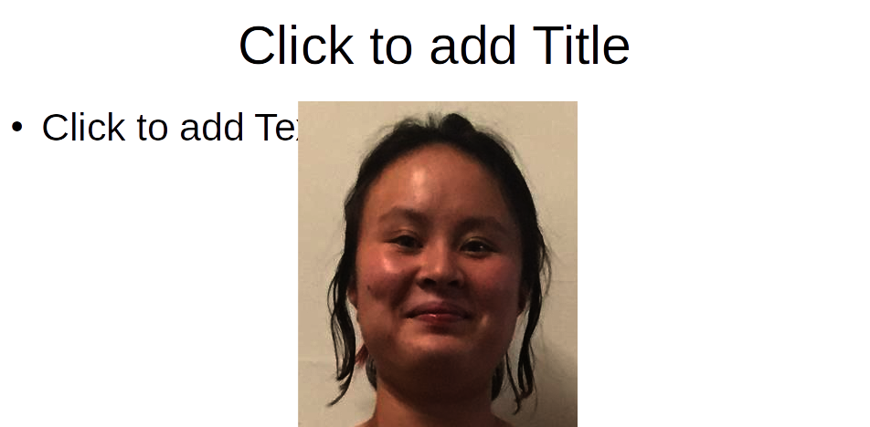
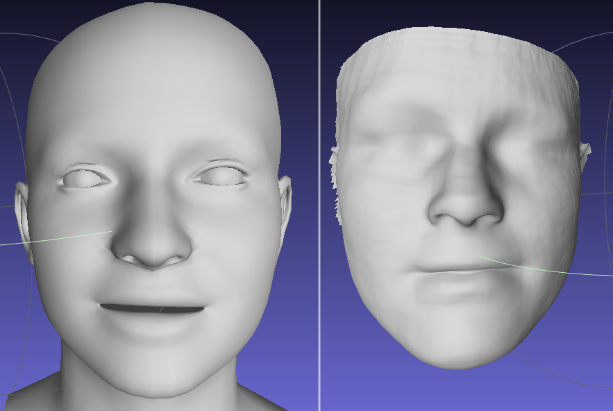
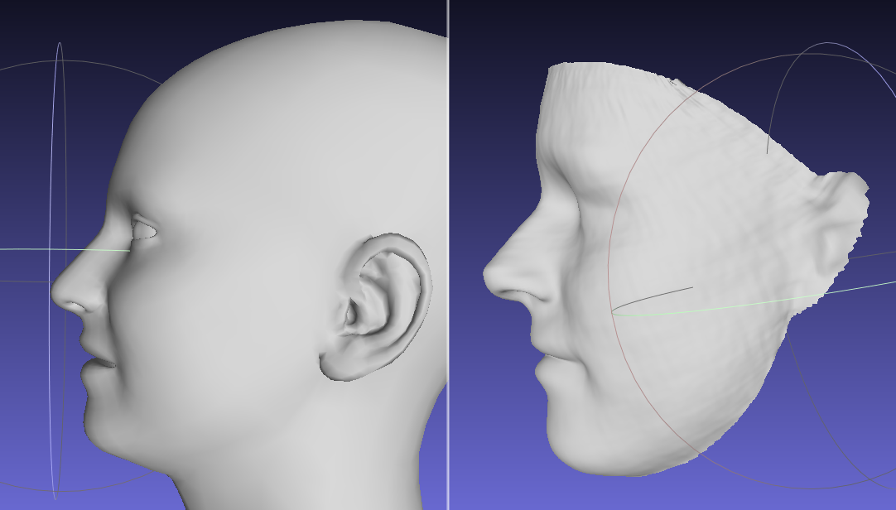
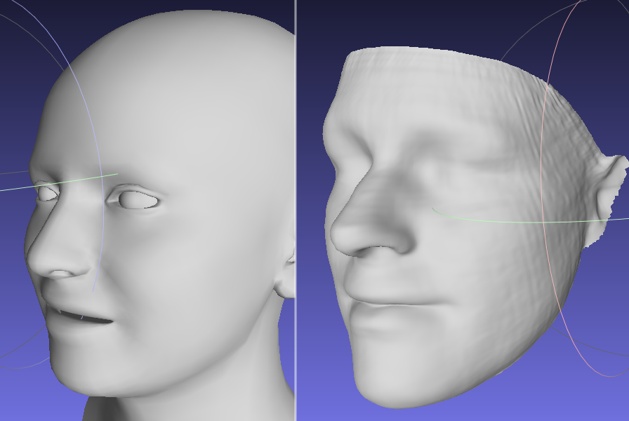
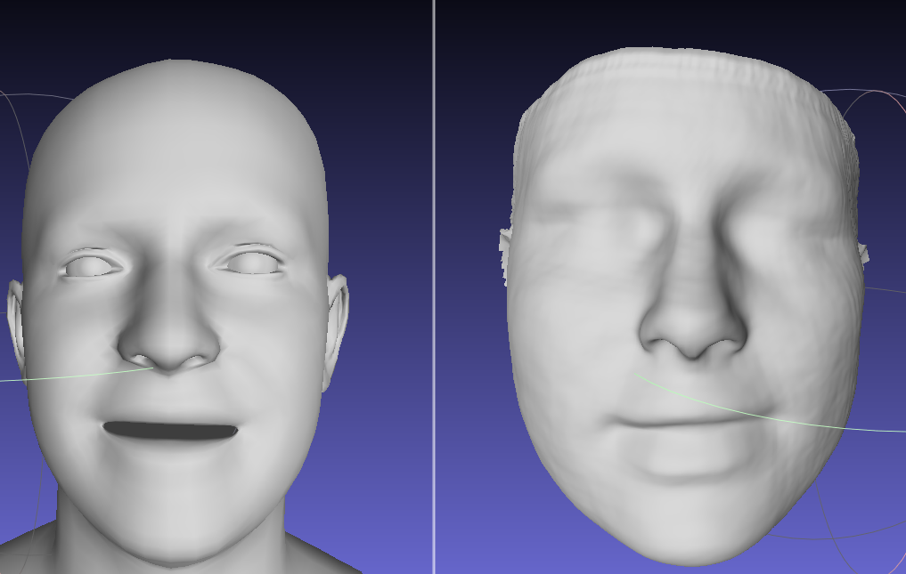
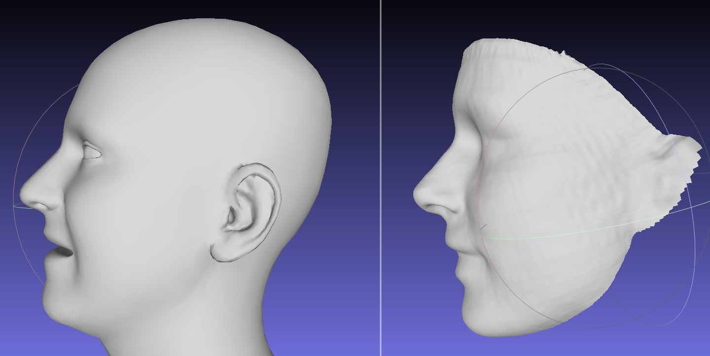
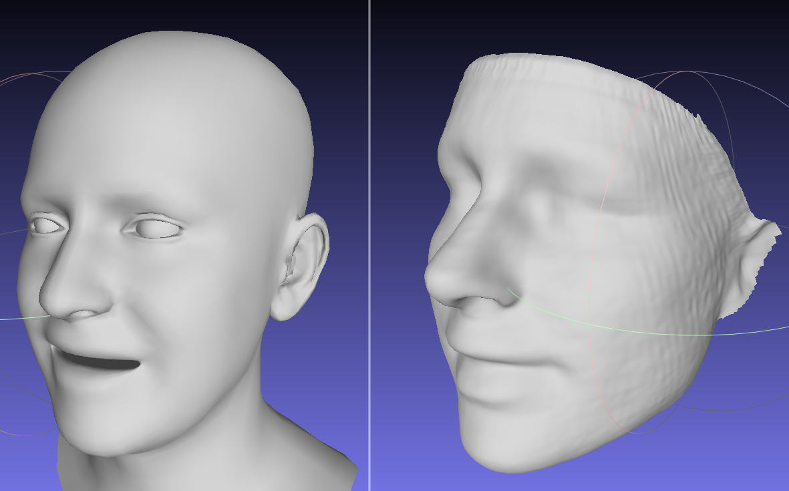

# Result comparision between two face libraries: Ringnet Maxplank and Prn 

[Ringnet MaxPlank project page](https://github.com/soubhiksanyal/RingNet)
training data:
- X: multiple images of a single subject + 2D kepoints
- Y: parameters to the maxplank face statistical model: [Flame](http://flame.is.tue.mpg.de/)

[Prn project page](https://github.com/YadiraF/PRNet)
- X: a single image of a subject
- Y: the position map 256x256x3 (xyz vertex) of face, calculated from 
[the statistical model](https://faces.dmi.unibas.ch/bfm/) 

# Obj file result
[Google drive link](https://drive.google.com/open?id=1hDn0byzI0YGF6EA1HVhbjg8gsCILSS6L)

# Result visualization

## Cory's image

## Oh's image

