<!-- @import "[TOC]" {cmd="toc" depthFrom=1 depthTo=6 orderedList=false} -->
<!-- code_chunk_output -->

- [Pipeline](#pipeline)
  - [Run PRN facelib.](#run-prn-facelib)
  - [Adjust input image (optional stage)](#adjust-input-image-optional-stage)
    - [Idea 1](#idea-1)
    - [Idea 2](#idea-2)
    - [Problems with seamless cloning.](#problems-with-seamless-cloning)
  - [Texuture mapping](#texuture-mapping)
- [Problems](#problems)
  - [Position map outisde factial region causes backgound in the final texture](#position-map-outisde-factial-region-causes-backgound-in-the-final-texture)
    - [Experiment 1: make background black in a hope to increase PRN facelib accurarcy](#experiment-1-make-background-black-in-a-hope-to-increase-prn-facelib-accurarcy)
  - [Incorrect nostril color problem](#incorrect-nostril-color-problem)

<!-- /code_chunk_output -->

# Pipeline
## Run PRN facelib.
The result consists of the following information
- Position map: a 3-channel image of size (256x256) that contains (x,y,z) coordinates of the 3D face.
This position map is the direct output of the convolution neural network of the PRN facelib.
From this (x,y,z) position map, we can infer the depth map, texture map and landmark positions.
Below is the plotting of the (x,y) channels of the position map over the input image.

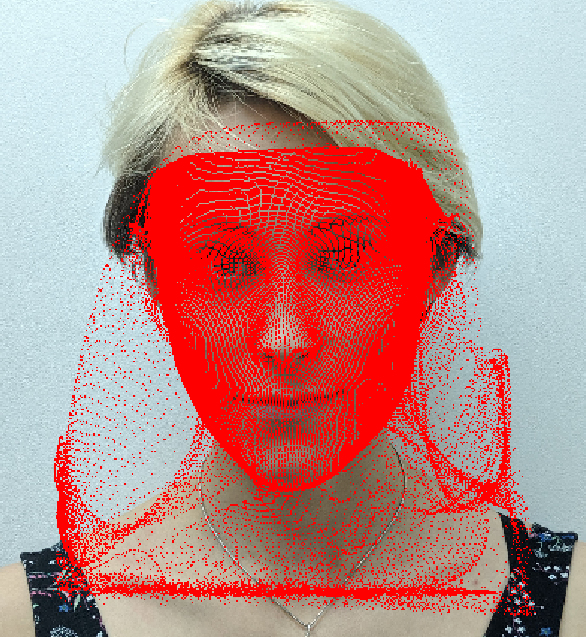

- 68 facial landmarks: these landmarks are extracted directly from the position map image using
a pre-defined set of x,y indices to the position map. Note that these x,y values are different from the (x,y,z) values stored in the position map. Below are 68 landmarks plotted on the face image. Due to the position map is incorrect, the landmarks are incorrect as well, as shown by the red points inside the green contour.

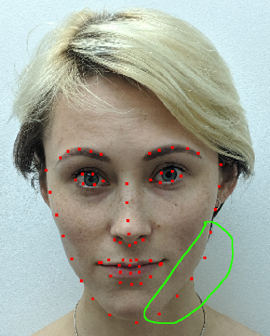

- Texture map: It is made of the (x,y) channels of the position map.
Specifically, it is a mapping from the facial region of the input image to a rectangular texture of (256x256). Below is the visuaslization of a texture extracted using this texture map. The black/white area along jaw is due tu the inaccuracy of the position map in that region.

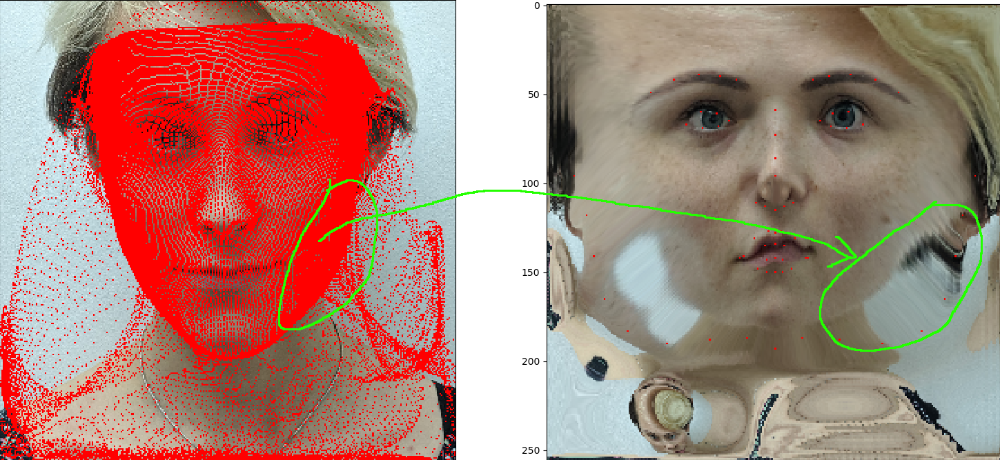

## Adjust input image (optional stage)
The texture map (x,y channels of position map) maps (R,G,B) pixels from the facial region of the input image to the 256x256 texture map. There are two problems regardign this mapping.
- Because the position map is incorrect, it also maps some background area along jaw from the input image to the texture, as explained in the previous stage.
- The texture map also maps hair to the texture.

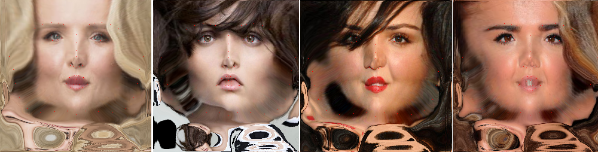

### Idea 1
- Apply grabcut to detect skin region. The foreground mask for grabcut is created by exclude the eye and lip polygons from the convex polygon of the 68 landmarks, and then erode with a kernel of 10x10 to make sure that there is no wall/background color inside the foreground mask.

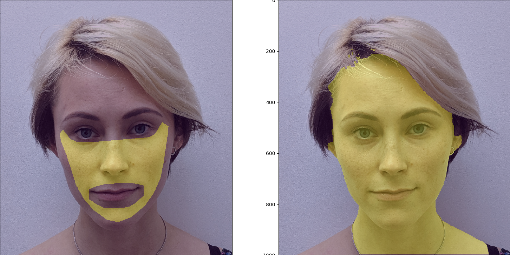

- Create a background image filled with the estimated skin color.
- Apply seamless cloning to transfer the facial area with grab-cut mask to the skin background image. The middle figure shows result without cloning, just replace every pixels outside the skin mask by estimated color. The right-most figure shows the result with seamless cloning.

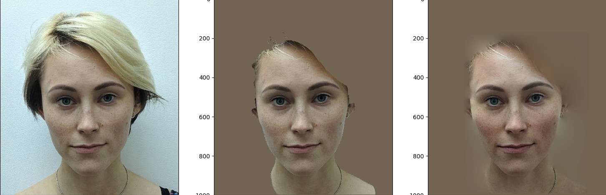

### Idea 2
One of the two main motivations behind skin segmentation is that the (x,y,y) position map from the PRN facelib covers some background region, which bring background pixels into the final texture. There are two other approaches to solve this problem.
- Because the error just often occur along the jaw area, we can pre-define a mask over the Victoria texture map that specifies possible error regions so that we can replace them by skin color later. This approach is very simple. It could be very effective if we could have a good skin color estimation and a smooth seam between the real facial region and skin color regions.
- Another approach is that we can post-process the (x,y,z) position map by warping them in a a way that (x,y) locations will stay inside the facial region. To do this, we can use OpenCV to detect another 68 facial landmarks to be used as target for warping algorithm. However, there could be two further problems with this approach. Firstly, we are also not sure about how good the OpenCV/Dlib landmarks are. Warping based on just facial landmarks might not enough because some points in the (x,y,z) position maps lie outside the polygon formed by the facial landmarks. Therefore, even that facial landmarks are well aligned with facial contours, the position map could still cover some background regions.

### Problems with seamless cloning.
-  Seamless cloning modifies the foreground object color (in our case, the foreground is the facial region) to match to the background color. Therefore, when the background color (estimated skin color) is too far away from the face color, it will change the face color. As an example, you can see the color of the lion in the below figure is transformed toward green to match the background color. For more examples about seamless cloning, check [this link](http://www.ctralie.com/Teaching/PoissonImageEditing/)

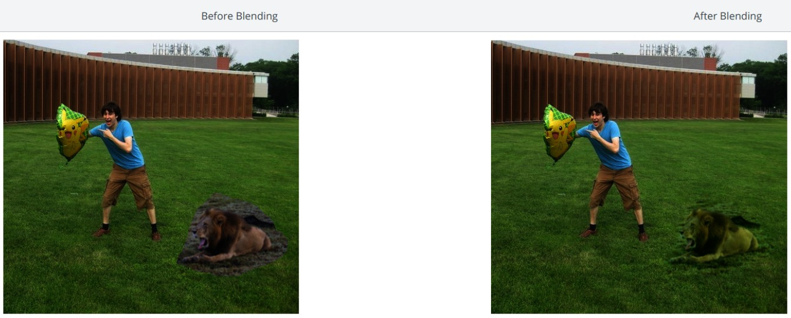
- In some cases, even that the estimated skin color is quite similar to the face color, seamless cloning saturates the face region toward white. In my opinion, it could be possible that in these cases, both estimated skin and face colors are already too bright. When I tried to reduce the brightness of the estimated skin color (skin_color = 0.85*skin_clor), the seamless cloning result becomes less saturated.  

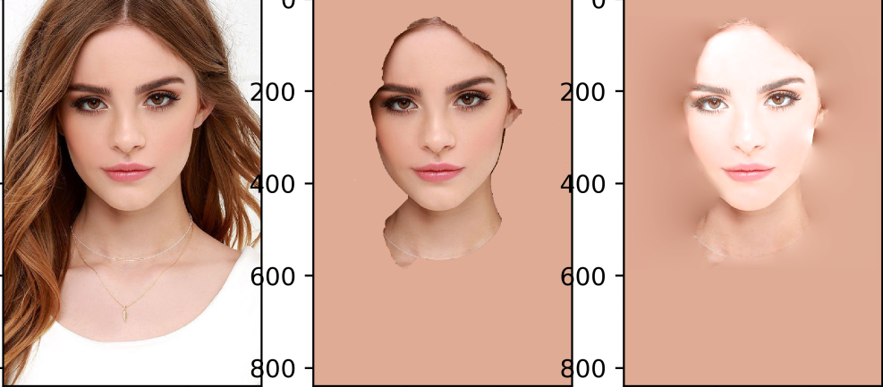

## Texuture mapping
- step 1: Map the modified input image to PRN facelib texture

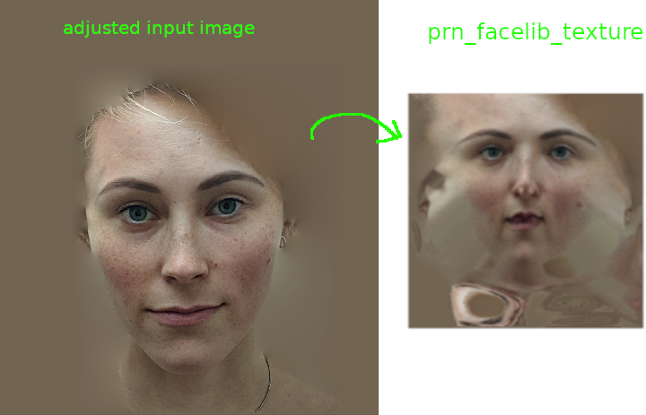

- step 2: Map the PRN facelib texture to the Victoria texture space. the yellow mask is a predefined texture mask that specifies our interest region inside the PRN texture space. We will use seamless cloning again here to clone this yellow region to the Victoria texture space

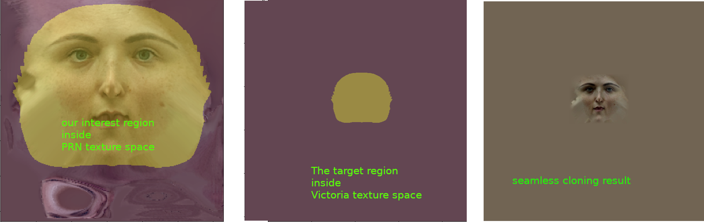

# Problems
## Position map outisde factial region causes backgound in the final texture
### Experiment 1: make background black in a hope to increase PRN facelib accurarcy
Result: prediction result is still similar. Background still interferes with texture

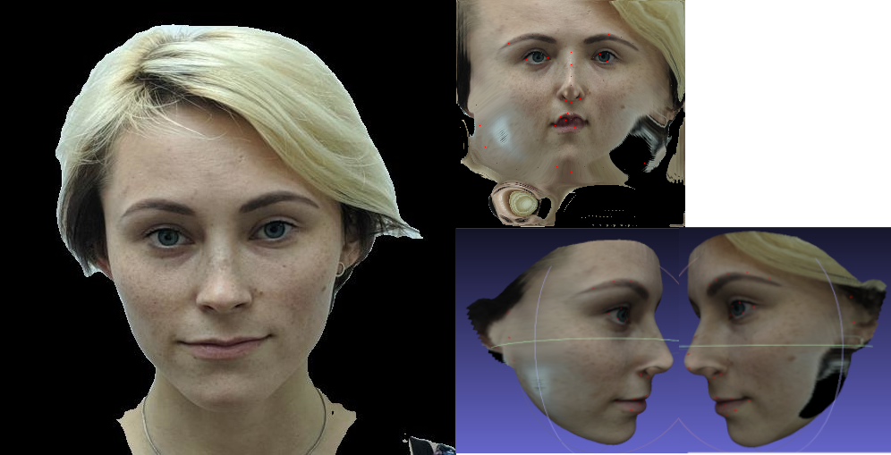

## Incorrect nostril color problem
The below picture visualizes the black artifact under nostril. Specifically, the bottom of nostril
has black color but the nostril itself is kind of brighter.

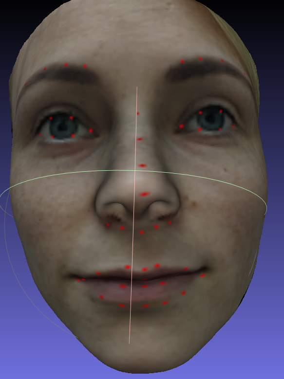

The below figure visualize the mapping/warping from the input image to the PRN texture.

The blue points in the left image denotes the (x,y) coordinates of 3D points in the position map from PRN facelib.
In other words, these blue points represent an orthogonal projection of vertices of the 3D face mesh (the position map) onto the input image face;
therefore, one blue point in the left image could be the projections of multiple 3D points in the 3D face mesh.

The right image is the PRN facelib texture. Because this is a texture, each of its pixels is mapped uniquely to
one 3D point in the 3D mesh. Also, each of its pixel is mapped to one blue point in the left image; however, this could b
many-to-one mapping because one blue point could be the projection of multiple 3D points, as explained earlier.  
This mapping is basically how the PRN facelib texture is constructed.

***Why the nostril bottom is not black like its bottom***: I think this is one disadvantage of constructing texture
directly from the input image. The nostril itself is invisible in the input image; therefore, there is no way that its
color in the texture could be constructed. How could we construct one thing that does not exist?

***Solution_1***:
replace black shadown pixels with skin color in the input image (left image below)
 
***Solution_2***:
replace black shadown pixels with skin color in the PRN texture (right image below)
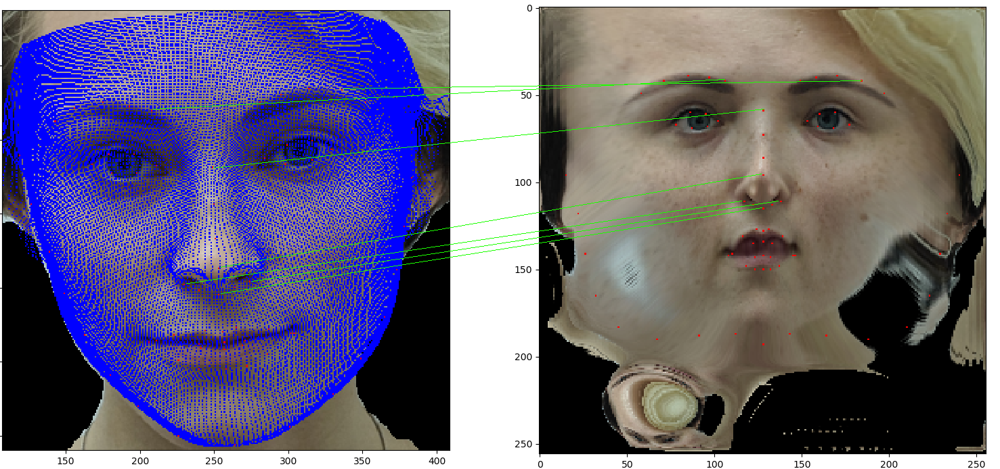
