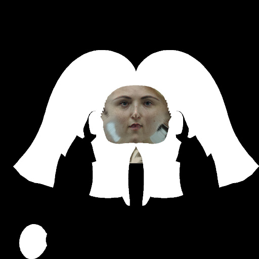
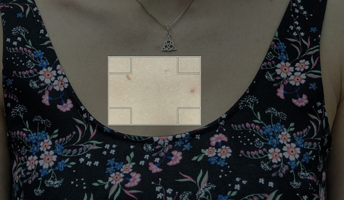
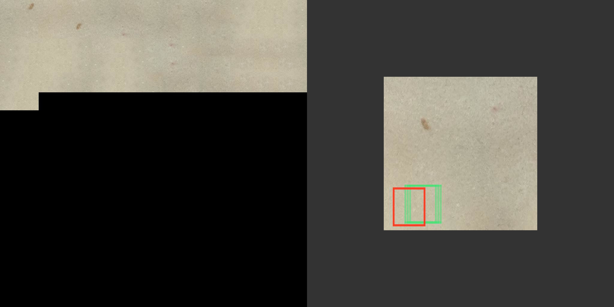
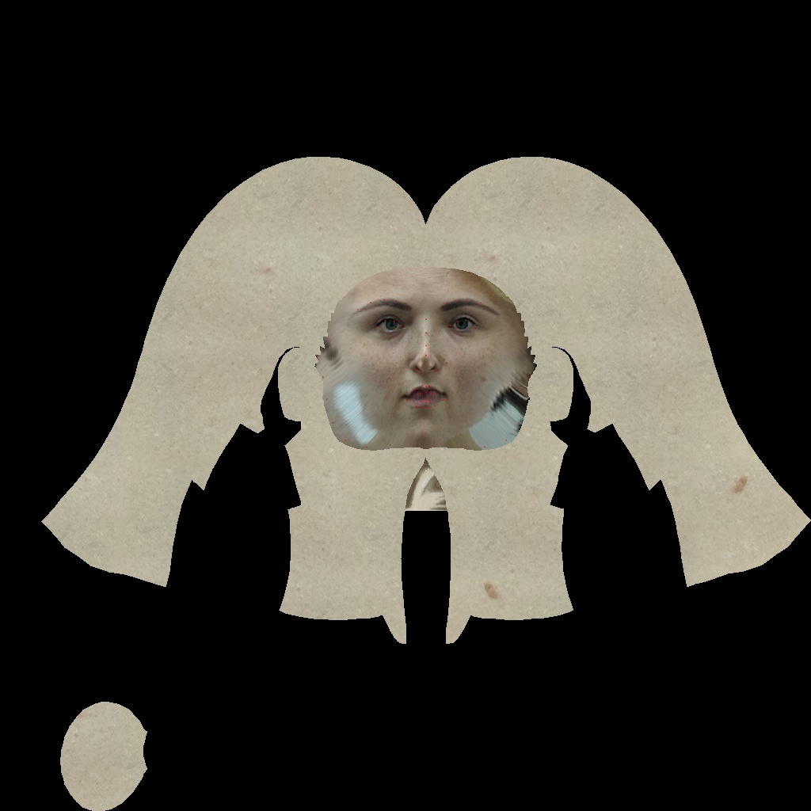
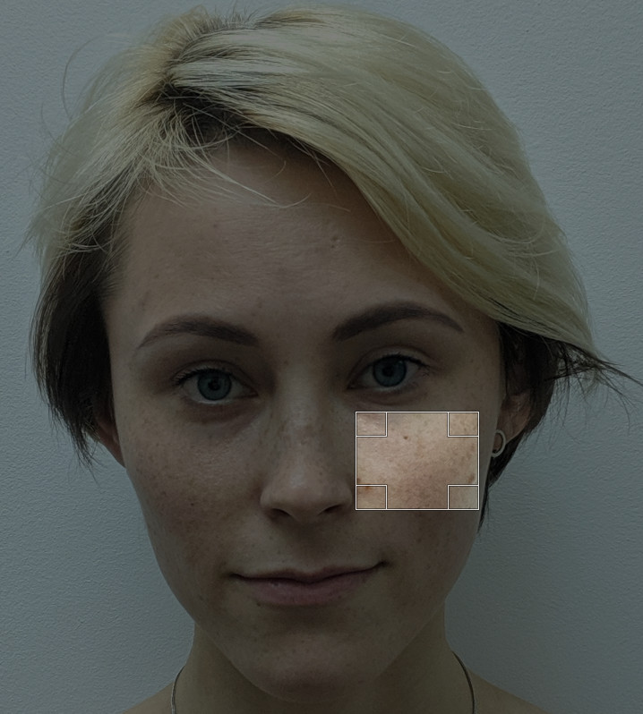
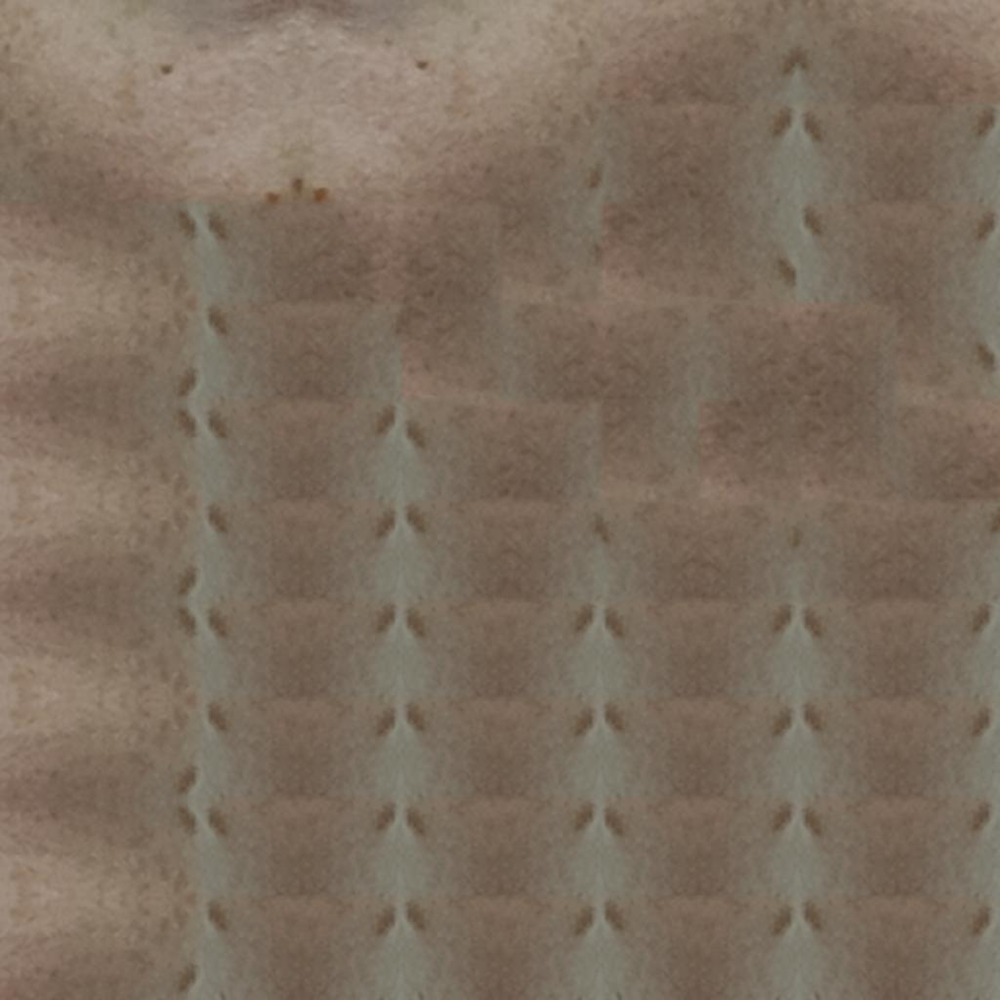
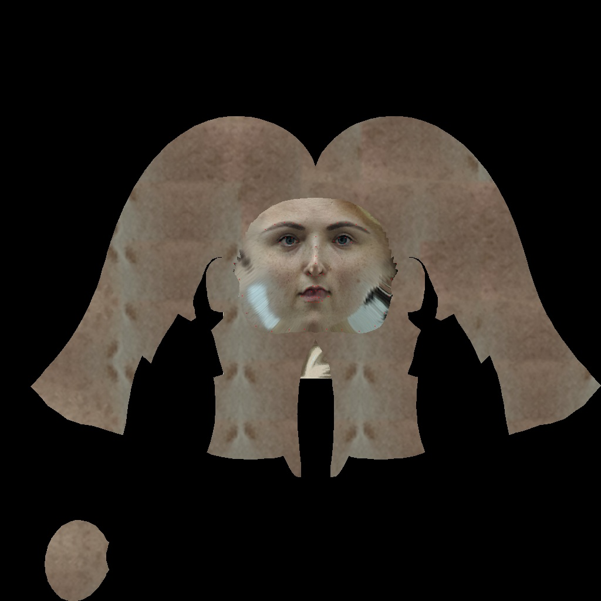
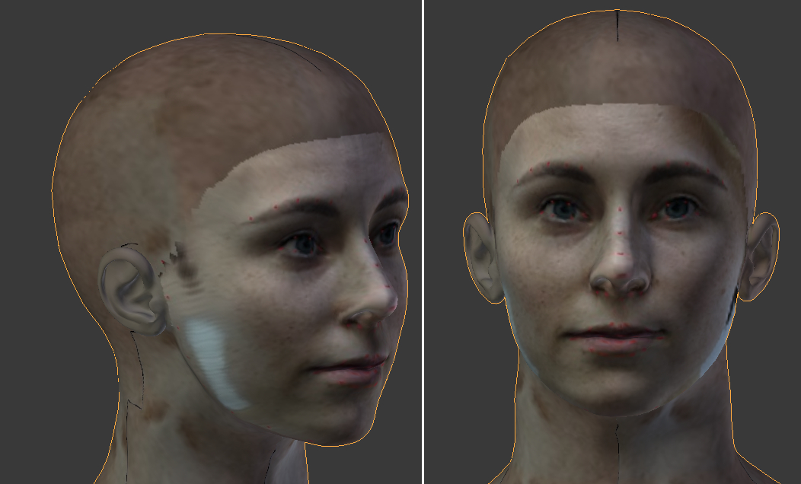

# problem definition
the white mask region in the below figure represents the non-facial part 
in the head and neck texture. we need to fill in this region with skin color so that 
it looks natural in 3D. 

## patch-based method
- texture patch sample
    - step 1: take a rectangle sample from the original image
        - 
    - patch-based synthesis: from the rectangle sample in the previous step, 
    more sub-rectangles are randomly resampled inside it (the red, green rectangles in the below figure) to build up  
    a larger texture image. These sub-rectangle samples are called tiles. The boundary between tiles
    are also smoothed out.
        - 
    - masking: the while mask in the probolem definition is used to mask out face and unrelated parts in the head texture.
        - 
    - result in 3D
        - 

## patch-based method (with sample at cheek region)
- 
- 
- 
- 

## upsample method
- take a sample at the cheek region and resize it to match the texture size
- problem: the upsampled texture looks very blur and unnatural.

## k-means based method
- take a sample at the cheek region
- apply k-means to cluster all other colours in this region into 3 main colors
- use the color of the highest cluster as the skin color
- fill in texutre image under white mask with the skin color
- problem
    - the texture doesn't look natural because there're just a single color
    
    
# Papers
- [2017 - Photorealistic Facial Texture Inference Using Deep Neural Networks](http://openaccess.thecvf.com/content_cvpr_2017/papers/Saito_Photorealistic_Facial_Texture_CVPR_2017_paper)
- [2014 - GPU-based skin texture synthesis for digital human model](https://content.iospress.com/download/bio-medical-materials-and-engineering/bme1034?id=bio-medical-materials-and-engineering/bme1034)
- [2006 - Image Analysis and Synthesis of Skin Color Textures by Wavelet Transform](https://ieeexplore.ieee.org/stamp/stamp.jsp?arnumber=1633749)
- [2003 - Image-based skin color and texture analysis/synthesis by extracting hemoglobin and melanin information in the skin](https://www.researchgate.net/profile/Y_Miyake/publication/220183764_Image-based_skin_color_and_texture_analysissynthesis_by_extracting_hemoglobin_and_melanin_information_in_the_skin/links/5447183f0cf22b3c14e0bdf8/Image-based-skin-color-and-texture-analysis-synthesis-by-extracting-hemoglobin-and-melanin-information-in-the-skin.pdf) 
- [2003 - Image Quilting for Texture Synthesis and Transfer](https://people.eecs.berkeley.edu/~efros/research/quilting/quilting.pdf)
    - [souce code](https://github.com/afrozalm/Patch-Based-Texture-Synthesis)
    
# Texture synthesis
    - https://github.com/anopara/texture-synthesis-nonparametric-sampling
    