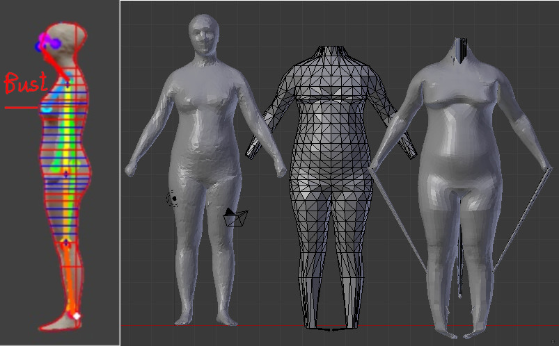
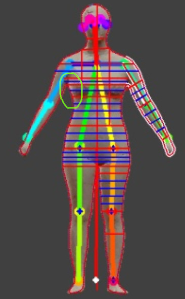
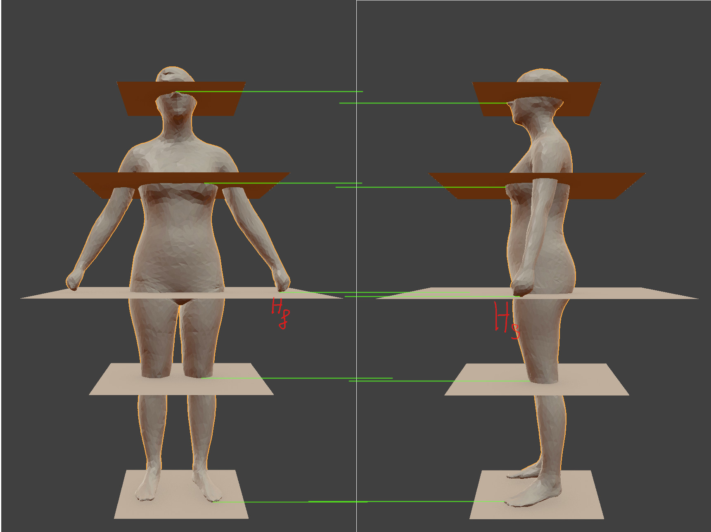

# table of content
- [Advantages](#Advantanges)
- [Disadvanges](#Disadvanges)
  - [a complex pipeline in the testing time.](#a-complex-pipeline-in-the-testing-time.)

# Advantanges
- with a good contour, we can sample as many as slice as possible at complex regions like armpit and bust, which in turn will help improve the deformation result. However, getting good contours in practice is very hard. 4 years after the paper about the slice method is published, the same author also introduced an improvement that instead of using the direct contour calculated from silhouettes,they predict contours. The predicted contours will serve as an ideal contour for slice sampling.   
  - Predicting realistic and precise human body models under clothing
based on orthogonal-view photos
  - Intelligent Clothing Size and Fit Recommendations based on Human Model Customisation Technology

# Disadvanges
  ## a complex pipeline in the testing time.  
  - correct pose joints so that the relative locations between joints in the front profile match to the relative locations of corresponding joints in the side profile
  - estimate landmark slice location (bust, under_bust,..) in side profile
  - estimate slice location in front-profile
  - convert slice measurement (width/depth) form image metrics to human metrics based on the image height ratio and customer's height.
  - predict slice shapes using 24 slices decision tree models from on width/depth ratios
  - from slice prediction, set control mesh coordinates.
  - use modified control mesh to deform Victoria

  ## unstable important slice locations
  - to detect landmark slice location such as bust, under_bust and crotch, we use local curvature as a hint to locate these points. Unfortunately, curvature is often not a stable evidence due to noise along the side profile contour. An incorrect locations for these slices will distort the final mesh heavily, as shown in below.
  

  ## coarse control mesh resolution at complex regions.
  - we need more slices to represent complex shapes at breast and armpit areas, but it's very hard to interpolate more slices at armpit regions because these regions are strongly affected by silhouette noise.
  

  ## perspective distortion
  - In addition to problems about scalability discussed in the CNN method, perspective distortion also causes the slice method another problem. With the slice method, we have to determine the slice locations in both front and side profiles. These locations are then used to calculate width and depth of each slice. When the slice locations are misaligned, the extracted width from the front profile will not correspond to the extracted depth from the side profile, which results in incorrect results
  

  - why does it happen?
  Let's consider two points $H_s$ and $H_f$ in the above figure as an example. They are both the hand tip of the human subject, but in the image, they are not located at the same height level, as depicted by the gap between two horizontal green lines. The mismatch happens because the depth of the hand tip point is changed when the human subject is rotated $90^{\circ}$ in the side profile. Specifically, in the side profile, the hand tip point is closer to the camera than the corresponding point in the front profile. It is this depth difference that causes the mismatch in perspective projection.

  - how could we solve it?
  This problem doesn't happen with the orthographic projection, but how to achieve an orthographic projection from a perspective projection?

  ## A Pose variant
  - the slice method is also affected by A pose variants. Currently, we measure width and depth of each slice along horizontal direction, and when the torso is leaned toward or backward, a measurement along horizontal direction won't be correct any more. We should measure along the perpendicular direction to the principal direction of the torso. Unfortunately, it's very hard to get a good estimation of the principal direction of the torso due to the accuracy of OpenPose.
