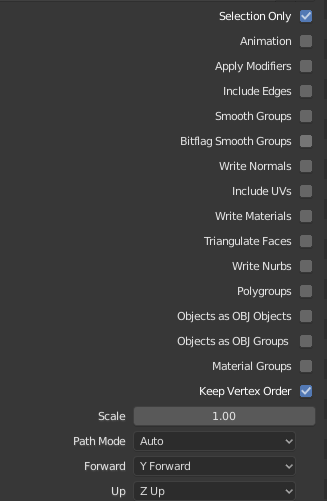

# Overview

- to deform all Victoria to match all mpii-caesar meshes, first we need to calculate a parameterization of victoria mesh with respect to the mpii template mesh. Specifically, one vertex of Victoria will be represented with respect to multiple close triangles of MPII mesh.

- The calculation of parameterization requires two template meshes are well aligned. Vertices of one mesh should be exactly on the surface of the other mesh and landmark vertices should be as close as possible to the corresponding landmark vertices.

# Alignment procedure
- create correspondences between Victoria template meshes and template MPII and UCSC meshes using
[the Softwrap add-on](https://blendermarket.com/products/softwrap). The resulting blender file can be found here

- save the resulting blender file as another name, open and run script bld_fix_hand.py under src/blender_scripts folder.
This step is needed because the hand and feet from Softwrap is collapsed and heavily distorted. The script
will replace the deformed hand and feet will the original hand and feet. Following the instruction inside
the script and run the script. After running the script, manually smooth the hand and feet boundary.

- export aligned obj files. obj export option in blender should be like as


# Parameterization for two aligned mesh pairs (Victoria-MPII), (Victoria-UCSC) 

- run /deformation/ffdt_deformation_parameterize_tool.py
- sample command for UCSC

    ```bat
    python ./deformation/ffdt_deformation_parameterize_tool.py
    -ctl ./data/meta_data_shared/body_alignment/ucsc_vic_aligned.obj
    -tpl ./data/meta_data_shared/body_alignment/vic_ucsc_aligned.obj
    -out_name_id victoria_ucsc_parameterization
    -o ./data/meta_data_shared/body_alignment/
    -mode global
    --effective_range 4
    ```

- sample command for MPII
    ```bat
    python ./deformation/ffdt_deformation_parameterize_tool.py
    -ctl ./data/meta_data_shared/body_alignment/mpii_vic_aligned.obj
    -tpl ./data/meta_data_shared/body_alignment/vic_mpii_aligned.obj
    -out_name_id victoria_mpii_parameterization
    -o ./data/meta_data_shared/body_alignment/
    -mode global
    --effective_range 4
    ```
 
- note: if there are isolated vertices (printed out) while calculating deformation, please go back
editting the hand and feet of Victoria to make it fit closely to UCSV or MPII meshes.

# Deformation
transfer all shapes from MPII meshe and UCSC meshes to Victoria

- sample command for MPII
    
    ```bat
    python ./src/caesar/transfer_mpii_caesar_shapes.py
    -in_dir ./caesar_obj/caesar_obj/ 
    -parameterization_path ./data/meta_data_shared/body_alignment/global_victoria_mpii_parameterization.pkl \
    -template_mesh_path ./data/meta_data_shared/body_alignment/vic_mpii_aligned.obj 
    -control_mesh_path ./data/meta_data_shared/body_alignment/mpii_vic_aligned.obj 
    -out_dir ./victoria_caesar/mpii
    -n_process 4
    ```
    
- sample command for UCSC female

    ```bat
    -in_dir ./SPRING_FEMALE/mesh/
    -parameterization_path ./data/meta_data_shared/body_alignment/global_victoria_ucsc_parameterization.pkl
    -template_mesh_path    ./data/meta_data_shared/body_alignment/vic_ucsc_aligned.obj
    -control_mesh_path ./data/meta_data_shared/body_alignment/ucsc_vic_aligned.obj
    -out_dir ./victoria_caesar/ucsc_female
    -n_process 4
    ```

- sample command for UCSC male

    ```bat
    -in_dir ./SPRING_MALE/mesh/
    -parameterization_path ./data/meta_data_shared/body_alignment/global_victoria_ucsc_parameterization.pkl
    -template_mesh_path    ./data/meta_data_shared/body_alignment/vic_ucsc_aligned.obj
    -control_mesh_path ./data/meta_data_shared/body_alignment/ucsc_vic_aligned.obj
    -out_dir ./victoria_caesar/ucsc_male
    -n_process 4
    ```
 
# alignemnt deformed UCSC and MPII
this is needed because UCAC and MPII have different default transformation
```bat
python ./src/caesar/align_ucsc.py
 ```