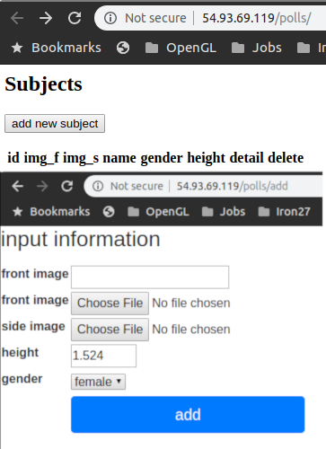
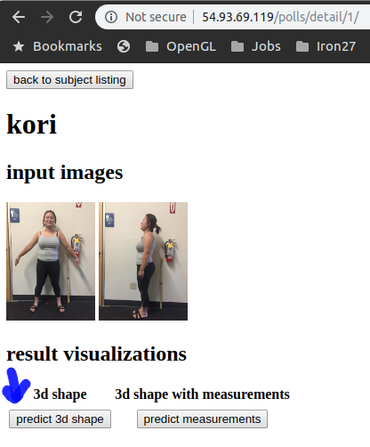
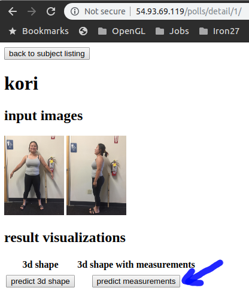

<!-- @import "[TOC]" {cmd="toc" depthFrom=1 depthTo=6 orderedList=false} -->
<!-- code_chunk_output -->

- [Install requirements](#install-requirements)
- [Docker issue](#docker-issue)
  - [DNS issue](#dns-issue)
- [Usage](#usage)
  - [Add a new subject](#add-a-new-subject)
  - [Predict shape](#predict-shape)
  - [Calculate and visualize measurements (require predicted shape)](#calculate-and-visualize-measurements-require-predicted-shape)

<!-- /code_chunk_output -->

# Install requirements

pull the code
```bat
git clone https://github.com/khanhha/human_estimation.git
```

configure AWS public IP address for Django
```bat
cd human_estimation/web_body/mysite
vim settings.py
add the public IP address of the AWS server to the variable, like this: ALLOWED_HOSTS = ['54.93.69.119']
```

build docker image
```bat
docker image build -t human:web .
```

run docker container (the argument -it is for interactive mode. For the first time, please use it for checking initialization errors)
```bat
docker run -it -p 80:8000 human:web
```

# Docker issue
## DNS issue
if there is problem with file downloading while building docker image, it could be due to DNS. The following solution helped me.
```
sudo vim /etc/docker/daemon.json
add the following line
{
    "dns":["192.168.1.1", "8.8.8.8"]
}
sudo systemctl daemon-reload
sudo systemctl restart docker
```


# Usage

## Add a new subject



## Predict shape



## Calculate and visualize measurements (require predicted shape)


